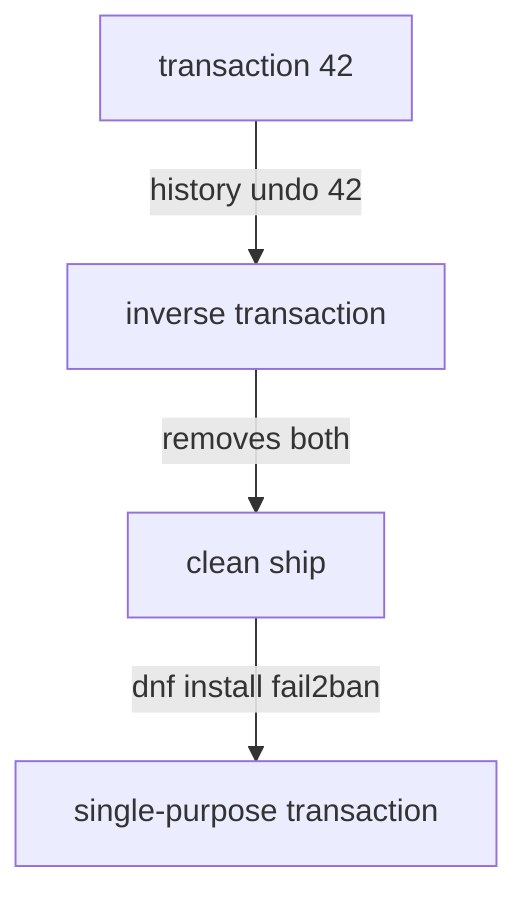

# Removing and Transaction History

Astronaut, retiring a crate is the other half of the supply run. RPM handles configuration files on removal by itself, one file at a time, so there is no "remove or purge" choice like on Debian. And `dnf` keeps a log of every transaction it ran, which lets it undo a whole past operation as one unit.

## Removing a package

Before you remove anything, confirm the package is installed and note its exact name.

### dnf remove

```bash
# shell: inside rpmbox
dnf list installed | grep telnet
sudo dnf remove telnet
```

`dnf` removes the package and hands the file work to `rpm`. Inside `rpmbox` you are already the root user; if the container answers `sudo: command not found`, run the command without `sudo`.

### What happens to %config files

Here RPM works differently from Debian. A package can mark some of its files as `%config`: configuration files the administrator may edit. On removal, RPM decides **per file, by itself**:

- A `%config` file **unchanged** since install is deleted with the rest of the package.
- A `%config` file that was **edited** is **renamed to `<file>.rpmsave`** instead of deleted.

There is no top-level "keep configuration" or "delete configuration" command to pick. It depends only on whether the file was actually changed. The mirror case, `<file>.rpmnew`, appears on *upgrade*: the package ships a new default for a configuration file you had edited, so RPM keeps your file and saves the new default beside it.

## Leftover dependencies do not clean themselves

Removing `telnet` never removes the dependency packages that only `telnet` pulled in. Those leftovers are called orphans.

### dnf autoremove

```bash
sudo dnf autoremove
```

`dnf autoremove` is the separate, deliberate step that removes packages installed as dependencies that no installed package still needs. `dnf` knows which packages you asked for yourself and which came in as dependencies; `dnf history userinstalled` lists the first kind. A cleanup that skips `autoremove` is an easy mark to lose.

## Transaction history

Every `dnf` run that changes packages is one **transaction**, and `dnf` writes each one to its log. Reading that log, and reversing an entry in it, is what sets `dnf` apart.

### Read the log

```bash
dnf history
```

This lists every transaction `dnf` has run, newest first. Each line has an ID, a description of the command and a count of changed packages.

```bash
dnf history info <id>
```

This expands one transaction: exactly which packages it installed, upgraded or removed.

### Undo a whole transaction

Say an install bundled in something unrelated, because someone typed `sudo dnf install fail2ban some-unwanted-package` as one command:


```mermaid
flowchart TB
    T["transaction 42"] -->|"history undo 42"| U["inverse transaction"]
    U -->|"removes both"| C["clean ship"]
    C -->|"dnf install fail2ban"| N["single-purpose transaction"]
```

The diagram shows transaction 42, which installed `fail2ban` and `some-unwanted-package`, being reversed by `sudo dnf history undo 42` in one step, after which `fail2ban` is installed again on its own.

```bash
sudo dnf history undo <id>
```

`history undo` works out the exact opposite of everything that transaction did and applies it as one operation, using `dnf`'s own recorded data. Rebuilding "what changed" by hand, package by package, is far less reliable once a transaction holds more than one package.

`dnf history redo <id>` applies a transaction again, including one you just undid by mistake. `dnf history rollback <id>` goes further: it undoes every transaction after the one you name.

## Common pitfalls

> [!WARNING]
> - **Looking for a `remove` or `purge` choice.** RPM has none. An edited `%config` file becomes `<file>.rpmsave` by itself; an unchanged one is deleted.
> - **Not noticing `.rpmsave` and `.rpmnew` files.** After a removal or upgrade, check `/etc` for them. They hold your old configuration or the new default.
> - **Assuming `dnf remove` cleans up leftover dependencies.** Run `dnf autoremove` as a separate step.
> - **Undoing a multi-package transaction by hand.** Use `dnf history undo <id>`; doing it by hand is error-prone.

## Your mission: DNF Basic Package Operations Lab

You can now check for and apply upgrades, install and remove packages, clean up leftovers and undo a transaction from the log. The mission runs a full maintenance window on a Rocky Linux 9 container, including undoing a deliberately mixed install.

Start the mission and open a terminal on it:

```sh
astrona run --git git@github.com:astrona-io/ATS002.git -c sections/section-060/module-03/labs/lab-01
astrona ssh ats-002-lab-063
```

On the lab machine, open a shell inside the `rpmbox` container with `docker exec -it rpmbox bash`. Read the task in [`question.md`](./labs/lab-01/question.md) and solve it on your own first. When you think you are done, send it for grading:

```sh
astrona submit -c sections/section-060/module-03/labs/lab-01
```

When the mission is done, remove it:

```sh
astrona destroy ats-002-lab-063
```
