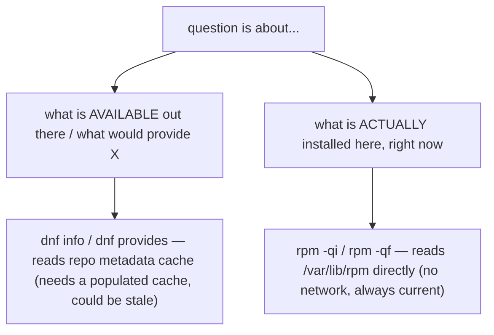

# Part 2 — What would provide this, and cross-referencing `rpm`

> Prerequisite: [Part 1 — Finding a package, and describing it](./course-01-search-and-describe.md). Next: [Section 060 quiz](../quiz.md).

`dnf provides` answers a question `rpm -qf` structurally cannot: "what package would I install to get this file or command?" This part is that lookup, listing installed packages by pattern, and when to trust `rpm` over `dnf`.

## `dnf provides` — repo-wide, install-state-independent

```bash
# shell: inside the rpmbox container
dnf provides /usr/sbin/ip
```

```text
iproute-6.2.0-5.el9.x86_64 : Advanced IP routing and network device configuration tools
Repo        : @System
Matched from:
Filename    : /usr/sbin/ip
```

`dnf provides` (alias `dnf whatprovides`) searches **every configured repository's metadata** for any package that declares it places a file at that path, or declares a matching capability — **independent of whether anything is installed**.

The structural contrast with `rpm -qf` (Module 1): `rpm -qf` searches only the *local installed database*. It can answer "what already-installed thing owns this file", never "what would I need to install to get it". `dnf provides` answers the second.

If unsure of the exact path (`/usr/bin` vs `/usr/sbin`, symlinked or not):

```bash
dnf provides '*/ip'
```

The leading `*/` glob matches any directory prefix — more robust than guessing a precise path when you only know the command name.

## Listing installed packages by pattern

```bash
dnf list installed | grep '^python3-'
```

Anchoring with **`^`** matches the start of the package-name column, not anywhere the string might appear (a version string, a repo name). Precise instead of noisy.

## When to cross-reference `rpm` instead



`dnf info` / `dnf provides` reflect `dnf`'s repository metadata cache — needs a populated cache and could be stale. `rpm -qi` / `rpm -qf` read the local RPM database: zero network dependency, always exactly what is on this system now. Complementary, not redundant: `dnf` for "what is available", `rpm` for "what is actually installed here".

> [!WARNING]
> - **Reaching for `rpm -qf` to find an *uninstalled* package's file** → it only searches installed packages. Use `dnf provides`.
> - **`grep 'python3-'` without `^`** → matches `libpython3-...` and mid-string hits. Anchor it.
> - **Trusting `dnf provides` with an empty/stale cache** → run `dnf makecache` (or `--refresh`) first.
> - **Guessing an exact path for `dnf provides`** → use `'*/name'` when you only know the command name.

> *`dnf provides <path-or-glob>` searches repository metadata to answer "what would I install to get this" (which `rpm -qf` cannot — it only knows installed packages); use `dnf` for what is available and `rpm -qi`/`-qf` for what is genuinely installed.*

## Reference

- `man dnf` — `provides` / `whatprovides`, `list installed`; glob matching.
- `man rpm` — `-qf`, `-qi`; reading the local database with no network.
- `dnf repoquery --whatprovides` / `--file` — the scriptable equivalent for automation.
