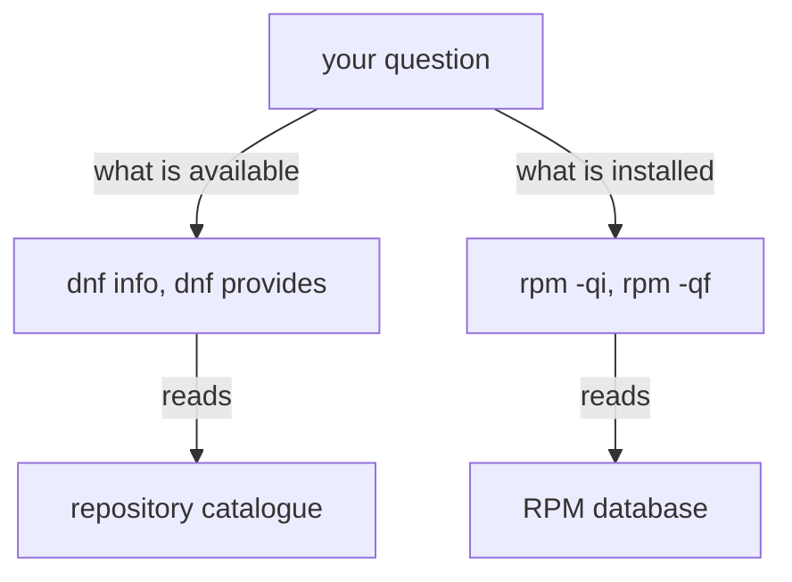

# Provides Lookups and Cross-Checking with rpm

Astronaut, a script fails because a command is missing, and you need to know which crate to order. `dnf provides` answers "which package would I install to get this file or command?", a question `rpm -qf` cannot answer at all. This part shows that lookup, how to list installed packages by pattern, and when to trust `rpm` over `dnf`.

## dnf provides: search the whole catalogue

`dnf provides` (also spelled `dnf whatprovides`) searches **every configured repository's catalogue** for a package that places a file at a path, or offers a matching capability. It does not matter whether anything is installed.

### Look up a path

```bash
# shell: inside the rpmbox container
dnf provides /usr/sbin/ip
```

```text
iproute-6.2.0-5.el9.x86_64 : Advanced IP routing and network device configuration tools
Repo        : @System
Matched from:
Filename    : /usr/sbin/ip
```

`Repo : @System` means the matching copy is already installed on this machine. For a package that is not installed, that line names the repository that offers it instead.

### Why rpm -qf cannot do this

`rpm -qf` searches only the *local installed database*. It can answer "which installed package owns this file?", never "what would I need to install to get it?". `dnf provides` answers the second question, because it reads the repository catalogue.

### Look up a command name with a glob

If you are not sure of the exact path (`/usr/bin` or `/usr/sbin`, a link or not), match any directory:

```bash
dnf provides '*/ip'
```

The leading `*/` matches any directory in front of the name. That is more robust than guessing a precise path when you only know the command name. Keep the quotes, so the shell passes the pattern to `dnf` unchanged.

## Listing installed packages by pattern

Sometimes the question is "which packages of this family are on board?".

### Anchor the pattern

```bash
dnf list installed | grep '^python3-'
```

The **`^`** anchors the match to the start of the line, which is the package-name column. Without it, `grep` also matches the string in the middle of other names or in a version or repository column. The anchor makes the result precise instead of noisy.

## When to cross-check with rpm instead

`dnf` and `rpm` read different sources, so they answer different questions.

### Which tool reads what


```mermaid
flowchart TB
    Q["your question"] -->|"what is available"| DNF["dnf info, dnf provides"]
    Q -->|"what is installed"| RPM["rpm -qi, rpm -qf"]
    DNF -->|"reads"| C["repository catalogue"]
    RPM -->|"reads"| DB["RPM database"]
```

The diagram shows that `dnf info` and `dnf provides` read the repository catalogue, while `rpm -qi` and `rpm -qf` read the local RPM database under `/var/lib/rpm`.

The catalogue must be downloaded first and can be out of date. The RPM database needs no network and always shows exactly what is on this ship right now. The two are partners, not copies: use `dnf` for "what is available" and `rpm` for "what is actually installed here". For scripts, `dnf repoquery --whatprovides` and `dnf repoquery --file` give the same answers as `dnf provides` in a form that is easier to process.

## Common pitfalls

> [!WARNING]
> - **Using `rpm -qf` to find the file of a package that is not installed.** It only searches installed packages. Use `dnf provides`.
> - **Using `grep 'python3-'` without `^`.** It also matches names such as `libpython3-...` and hits in the middle of a line. Anchor it.
> - **Trusting `dnf provides` with an empty or old catalogue.** Run `dnf makecache` (or add `--refresh`) first.
> - **Guessing an exact path for `dnf provides`.** Use `'*/name'` when you only know the command name.

## Your mission: DNF Package Information Lookup Lab

You can now search the catalogue, read a package's details, find which package provides a command and list installed packages by pattern. The mission asks you to research four questions without installing anything, and to save each answer in a file.

Start the mission and open a terminal on it:

```sh
astrona run --git git@github.com:astrona-io/ATS002.git -c sections/section-060/module-04/labs/lab-01
astrona ssh ats-002-lab-064
```

On the lab machine, open a shell inside the `rpmbox` container with `docker exec -it rpmbox bash`. Read the task in [`question.md`](./labs/lab-01/question.md) and solve it on your own first. When you think you are done, send it for grading:

```sh
astrona submit -c sections/section-060/module-04/labs/lab-01
```

When the mission is done, remove it:

```sh
astrona destroy ats-002-lab-064
```
