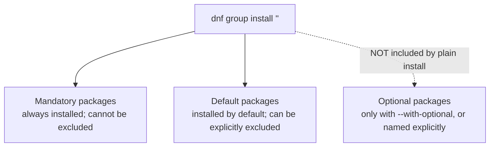

# Part 2 — Inspecting membership, and installing

> Prerequisite: [Part 1 — What a group is, and discovering what exists](./course-01-what-a-group-is-and-discovering.md). Next: [Part 3 — Confirming, and removing cleanly](./course-03-confirming-and-removing.md).

Never install a group blind. Its membership has three tiers, and the third one behaves differently from what most people assume under pressure. This part is reading `dnf group info` and choosing the right install command.

## The three membership tiers

```bash
# shell: inside the rpmbox container
dnf group info "Development Tools"
```

Prints the description, then three clearly separated sections:



| Tier | Plain `dnf group install`? | Notes |
|---|---|---|
| **Mandatory** | always | cannot be left out of a "with all mandatory members" install |
| **Default** | yes | can be excluded explicitly |
| **Optional** | **no** | a real member for completeness/discoverability, but not installed unless named or `--with-optional` is passed |

The trap: seeing a package under **Optional Packages** and assuming a plain group install brings it along. It does not.

`dnf group info` is a **pure read** of repository metadata — it installs nothing, and is the command that shows exactly what a plain install *would* bring in.

## Installing

```bash
sudo dnf group install "Development Tools"
```

Resolves and installs every **mandatory and default** member as one transaction — the equivalent of typing all those package names into one `dnf install`, except the list came from the metadata you just inspected, not memory.

```bash
sudo dnf group install "Development Tools" --with-optional
```

`--with-optional` also pulls in the optional tier. It is **never** the default.

Quote the group name if it contains spaces. A group can also be referenced by its ID (`dnf group list ids`), e.g. `dnf group install "@Development Tools"` or the id form — useful in scripts.

> [!WARNING]
> - **Assuming Optional-tier packages install with a plain group install** → they do not. Name them, or use `--with-optional`.
> - **Installing a group without `dnf group info` first** → you commit to a package set you never reviewed.
> - **Unquoted group names with spaces** → the shell splits them into separate arguments. Quote, or use the group ID.
> - **`--with-optional` as a habit** → it can pull in a large optional tier; use it only when you actually want those members.

> *A group has Mandatory (always), Default (yes, excludable), and Optional (only with `--with-optional` or by name) tiers; `dnf group info "<group>"` reads them without installing, and `dnf group install "<group>"` brings in mandatory + default only.*

## Reference

- `man dnf` — `group info`, `group install`, `--with-optional`, `--exclude`.
- Fedora comps docs — the semantics of `<packagereq type="mandatory|default|optional">`.
- `dnf group install "@group-id"` — the `@`-prefixed group reference usable anywhere a package name is expected.
