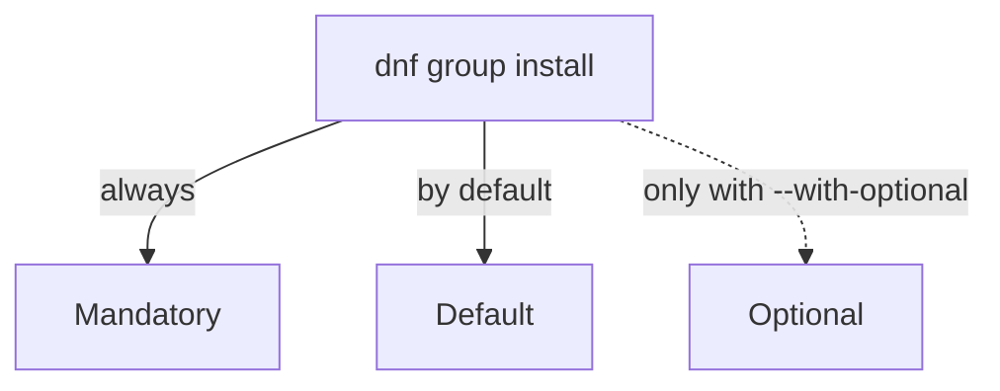

# Inspecting and Installing a Group

Astronaut, never order a bundle without reading its packing list. A group's members sit in three tiers, and the third tier does not behave the way most people assume under pressure. This part shows how to read `dnf group info` and choose the right install command.

## The three member tiers

`dnf group info` reads the group's definition from the catalogue and prints it. It installs nothing, and it shows exactly what a plain install *would* bring in.

### Read a group's members

```bash
# shell: inside the rpmbox container
dnf group info "Development Tools"
```

It prints a description and then three clearly separated lists: Mandatory Packages, Default Packages and Optional Packages.

### What each tier means


```mermaid
flowchart TB
    G["dnf group install"] -->|"always"| M["Mandatory"]
    G -->|"by default"| D["Default"]
    G -.->|"only with --with-optional"| O["Optional"]
```

The diagram shows that a plain group install brings in the Mandatory and Default members, while Optional members come only with `--with-optional` or when you name them yourself.

| Tier | Plain `dnf group install`? | Notes |
|---|---|---|
| **Mandatory** | always | cannot be left out of a "with all mandatory members" install |
| **Default** | yes | can be excluded explicitly |
| **Optional** | **no** | a real member for completeness/discoverability, but not installed unless named or `--with-optional` is passed |

The trap: you see a package under **Optional Packages** and assume a plain group install brings it along. It does not.

## Installing a group

One command installs the whole bundle, as one transaction.

### dnf group install

```bash
sudo dnf group install "Development Tools"
```

`dnf` works out and installs every **mandatory and default** member in one transaction. It is like typing all those package names into one `dnf install`, except the list comes from the catalogue you just read, not from memory. Inside `rpmbox` you are already the root user; if the container answers `sudo: command not found`, run the command without `sudo`.

### Adding the optional tier

```bash
sudo dnf group install "Development Tools" --with-optional
```

`--with-optional` also pulls in the Optional tier. It is **never** the default.

### Quoting and group IDs

Put the group name in quotes when it contains spaces; otherwise the shell splits it into separate arguments. You can also use the group's ID from `dnf group list ids`, or put `@` in front of a group name or ID anywhere a package name is expected, for example `dnf group install "@Development Tools"`. Both forms are handy in scripts. To leave one Default member out, add `--exclude=<package>` to the install.

## Common pitfalls

> [!WARNING]
> - **Assuming Optional members come with a plain group install.** They do not. Name them, or use `--with-optional`.
> - **Installing a group without running `dnf group info` first.** You commit to a set of packages you never reviewed.
> - **Leaving a group name with spaces unquoted.** The shell splits it into separate arguments. Quote it, or use the group ID.
> - **Using `--with-optional` out of habit.** It can pull in a large Optional tier. Use it only when you really want those members.
