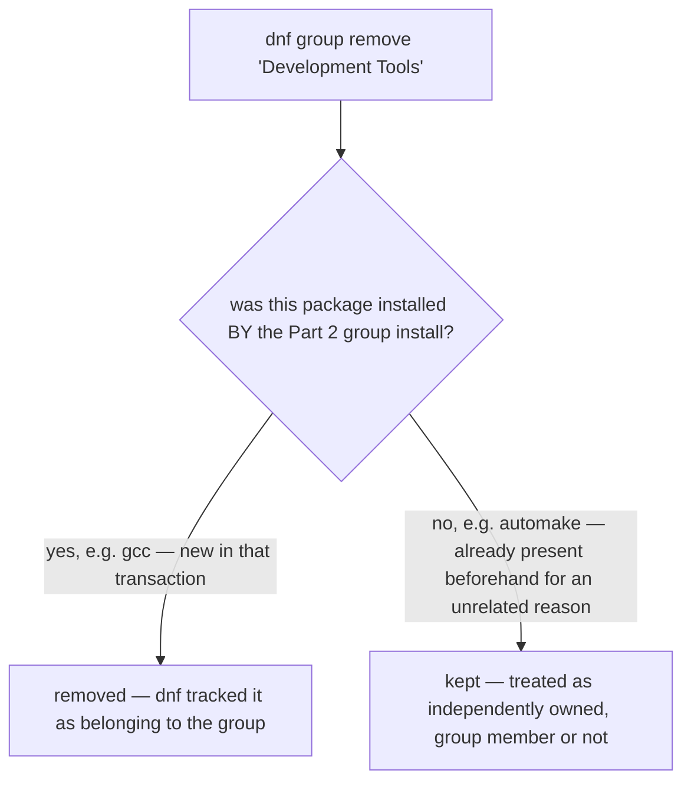

# Part 3 — Confirming what landed, and removing cleanly

> Prerequisite: [Part 2 — Inspecting membership, and installing](./course-02-inspecting-and-installing.md). Next: [Section 060 quiz](../quiz.md).

After a group install, confirm the set landed. And before removing a group, understand precisely what `dnf group remove` does — because it is driven by `dnf`'s own tracking, not by raw group membership, and that distinction has a concrete consequence.

## Confirm what landed

```bash
# shell: inside the rpmbox container
dnf group info "Development Tools"
```

Run the exact Part 2 inspection again. Post-install, each currently-installed member is marked with an installed-indicator, so you can visually confirm the mandatory/default set landed and see whether any optional members are present too.

```bash
dnf group list installed
```

Filters the group listing to groups `dnf` currently considers installed — the group-level analogue of `dnf list installed`. `"Development Tools"` should now appear.

## `dnf group remove` — tracking, not membership

```bash
sudo dnf group remove "Development Tools"
```

Read the semantics before running this on anything you care about: by default `dnf` removes packages it **tracked as installed specifically as part of this group installation** — *not* every package the group's metadata lists as a member.



Concrete: `automake` was already installed on this host, for an unrelated reason, **before** the Part 2 group install. `automake` is also a member of `"Development Tools"`. `dnf group remove` does **not** remove `automake` — a package present before the group install is independently owned. If it genuinely needs to go too, that is a separate `dnf remove automake`.

The inverse holds cleanly: `gcc`, freshly installed *because of* the Part 2 transaction and not present before, **is** removed by the group removal, because `dnf` tracked it as belonging to that transaction.

## Audit after removal

```bash
dnf group list installed
```

Confirm `"Development Tools"` no longer appears — the same audit command from above, run again after removal, the group-level equivalent of re-checking `rpm -q` after removing a single package.

> [!WARNING]
> - **Expecting `dnf group remove` to strip every group member** → it removes only what `dnf` recorded as installed *by* that group transaction.
> - **Assuming a pre-existing package leaves with the group** → it does not (`automake` survives). Remove it explicitly if needed.
> - **Assuming a group-pulled package survives** → it does not (`gcc` goes). Reinstall it explicitly if something else now needs it.
> - **Skipping the post-removal `dnf group list installed`** → confirm the group is actually gone, not just that the command exited.

> *`dnf group remove` removes only the packages `dnf` tracked as installed by that group's install transaction — a package present beforehand (`automake`) survives, one pulled in by the group (`gcc`) does not — so verify with `dnf group list installed` and remove any stragglers explicitly.*

## Reference

- `man dnf` — `group remove`, `group list installed`, `group mark install/remove` (adjust tracking manually).
- `dnf history` — cross-check which transaction installed a given package if the group tracking is ambiguous.
- Fedora docs, "groups vs environments" — `dnf environment` for the larger meta-groups built from groups.
