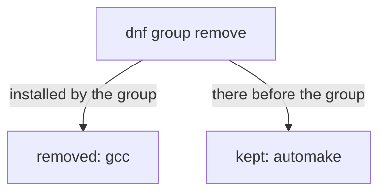

# Confirming and Removing a Group

Astronaut, after a group install you check that the bundle really landed. Before you remove a group, you need to know exactly what `dnf group remove` takes with it. It follows `dnf`'s own records of what the group installed, not the group's member list, and that difference has a concrete result.

## Confirm what landed

Two read-only commands show the group from both sides: its members and its installed status.

### Read the members again

```bash
# shell: inside the rpmbox container
dnf group info "Development Tools"
```

This is the same `dnf group info` you run before an install. After the install, each member that is now installed carries an installed marker, so you can see that the mandatory and default members landed and whether any optional members are there too.

### List the installed groups

```bash
dnf group list installed
```

This shows only the groups `dnf` considers installed, the group-level match for `dnf list installed`. `"Development Tools"` should now appear.

## dnf group remove follows records, not membership

When a group is installed, `dnf` records which packages that transaction brought in for the group. The removal uses that record.

### Run the removal

```bash
sudo dnf group remove "Development Tools"
```

Read what this does before you run it on anything you care about. By default, `dnf` removes the packages it **recorded as installed for this group**, *not* every package the group's definition lists as a member.

### Who stays and who goes


```mermaid
flowchart TB
    R["dnf group remove"] -->|"installed by the group"| REM["removed: gcc"]
    R -->|"there before the group"| KEEP["kept: automake"]
```

The diagram shows the two cases: a package the group install brought in is removed, and a package that was already installed before the group install is kept.

A concrete case: `automake` was already installed on this ship, for an unrelated reason, **before** the group install. `automake` is also a member of `"Development Tools"`. `dnf group remove` does **not** remove `automake`, because a package that was there before the group install belongs to nobody's group. If it really has to go too, that is a separate `dnf remove automake`.

The other way round works just as cleanly. `gcc` was not there before and was installed *because of* the group install. So the group removal **does** remove it, because `dnf` recorded it as part of the group.

If the records ever look wrong, `dnf history` shows which transaction installed a given package, and `dnf group mark install` or `dnf group mark remove` change the group records by hand without installing or removing anything.

## Audit after removal

```bash
dnf group list installed
```

Confirm that `"Development Tools"` no longer appears. It is the same check as above, run again after the removal: the group-level version of checking `rpm -q` after you remove one package.

## Common pitfalls

> [!WARNING]
> - **Expecting `dnf group remove` to strip every group member.** It removes only what `dnf` recorded as installed *by* that group.
> - **Assuming a package that was there before leaves with the group.** It does not (`automake` stays). Remove it yourself if needed.
> - **Assuming a package the group brought in survives.** It does not (`gcc` goes). Install it again yourself if something else now needs it.
> - **Skipping the final `dnf group list installed`.** Confirm the group is really gone, not just that the command finished.

## Your mission: DNF Package Groups Lab

You can now find a group, read its tiers, install it, confirm it and predict what its removal takes. The mission asks you to run that whole cycle with `"Development Tools"` on a ship where `automake` was installed beforehand, and to find out for yourself which packages survive.

Start the mission and open a terminal on it:

```sh
astrona run --git git@github.com:astrona-io/ATS002.git -c sections/section-060/module-05/labs/lab-01
astrona ssh ats-002-lab-065
```

On the lab machine, open a shell inside the `rpmbox` container with `docker exec -it rpmbox bash`. Read the task in [`question.md`](./labs/lab-01/question.md) and solve it on your own first. When you think you are done, send it for grading:

```sh
astrona submit -c sections/section-060/module-05/labs/lab-01
```

When the mission is done, remove it:

```sh
astrona destroy ats-002-lab-065
```
