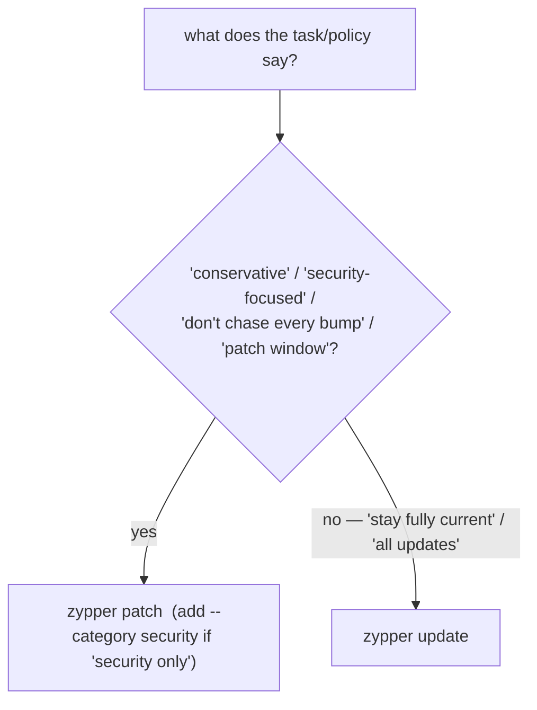

# Part 2 — Applying the right one: `zypper patch` vs `zypper update`

> Prerequisite: [Part 1 — Refresh, and the two questions: updates vs. patches](./course-01-refresh-updates-vs-patches.md). Next: [Part 3 — Installing, removing, and reading history](./course-03-install-remove-history.md).

Knowing what is out there is half the job; choosing how to act on it is where policy meets command syntax. Running the wrong verb here does not just use wrong syntax — it changes what actually lands on the system.

## `zypper patch` — only what is patch-covered

```bash
# shell: inside the zypperbox container, root
zypper patch
```

Applies **only** the updates covered by a currently published patch definition (Part 1). Everything security-classified lives here. This is the conservative posture: "stay current on what has been reviewed and flagged; do not chase every version bump."

Narrow it further by category or severity:

```bash
zypper patch --category security
zypper patch --severity important
```

## `zypper update` — everything available

```bash
zypper update           # shorthand: zypper up
```

Applies **every** available update, patch-covered or not — the "stay maximally current" posture. Appropriate for some environments; a genuine policy violation if the task called for a patch-only maintenance window.

## Reading the requirement



A scenario that says "conservative", "security-focused", "patch maintenance window", or "do not chase every package bump" is describing **`zypper patch`**. "Bring everything fully up to date" is **`zypper update`**. Read the wording before typing the verb.

After applying, `zypper list-updates` may still show entries — packages with a newer version but no patch — which is expected after a `zypper patch` run and is the visible proof the two are different operations.

> [!WARNING]
> - **`zypper update` when the task said "patch" / "conservative"** → you applied version bumps outside the reviewed patch set; that is over-shipping change, not just wrong syntax.
> - **`zypper patch` when the task said "fully up to date"** → non-patch updates are left behind.
> - **Expecting `zypper list-updates` to be empty after `zypper patch`** → it will not be; uncovered newer versions remain. That is correct.
> - **`--category` on `zypper update`** → category/severity filters belong to `zypper patch`; `update` has no reviewed-category concept.

> *`zypper patch` applies only patch-covered (and optionally `--category security`) updates — the conservative choice; `zypper update` applies every newer version. The task's wording ("conservative", "patch window" vs "fully current") tells you which.*

## Reference

- `man zypper` — `patch`, `patch --category` / `--severity` / `--with-optional`, `update` / `up`.
- `zypper patch-check` — a quick count of pending patches by category, for a maintenance decision.
- openSUSE docs, "Applying patches" — the categories and what `security` covers.
