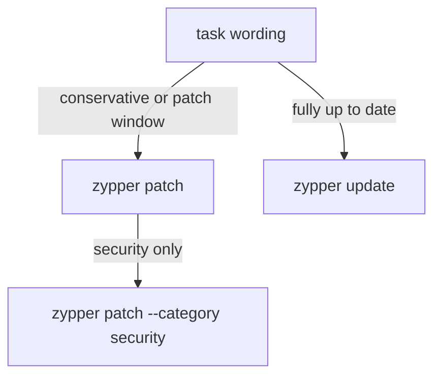

# Applying Patches or Updates

Knowing what is waiting in the depot is half the job. Choosing how to act on it is where policy meets the command line. If you type the wrong verb here, the problem is not just the syntax: a different set of packages lands on the system.

Run every command inside the `zypperbox` container as root. `docker exec` opens the shell as root by default.

## `zypper patch`: only what a patch covers

Apply the safety notices the depot has published:

```bash
# shell: inside the zypperbox container, root
zypper patch
```

`zypper` installs **only** the updates that a currently published patch covers. Every security fix SUSE tracks lives here. This is the conservative choice: "stay current on what has been reviewed and flagged, and do not chase every new version number."

You can narrow it further by category or by severity:

```bash
zypper patch --category security
zypper patch --severity important
```

The first applies only patches in the `security` category. The second applies only patches marked `important`. By default `zypper patch` leaves out `optional` patches; add `--with-optional` to include them.

## `zypper update`: everything available

The other verb takes every newer version it can find:

```bash
zypper update           # shorthand: zypper up
```

`zypper update` applies **every** available update, whether a patch covers it or not. This is the "stay as current as possible" choice. Some systems want exactly that. But if the task asked for a patch-only maintenance window, it breaks the policy.

## Reading the requirement

The command you type should come from the words in the task, not from habit.


```mermaid
flowchart TB
    T["task wording"] -->|"conservative or patch window"| P["zypper patch"]
    T -->|"fully up to date"| U["zypper update"]
    P -->|"security only"| S["zypper patch --category security"]
```

The diagram shows how the wording of a task leads to one verb: conservative or patch-window wording leads to `zypper patch` (narrowed to `--category security` when only security fixes are wanted), and "bring everything fully up to date" leads to `zypper update`.

Words like "conservative", "security-focused", "patch maintenance window" or "do not chase every package bump" describe **`zypper patch`**. "Bring everything fully up to date" or "all updates" describes **`zypper update`**. Read the wording before you type the verb.

After `zypper patch`, `zypper list-updates` may still show entries. Those are packages with a newer version but no patch. That is expected, and it is the visible proof that the two commands do different jobs.

In short: `zypper patch` applies only what a patch covers (optionally only `--category security`), which is the conservative choice; `zypper update` applies every newer version.

## Common pitfalls

> [!WARNING]
> - **Running `zypper update` when the task said "patch" or "conservative".** You applied version changes outside the reviewed patch set. That ships too much change, not just the wrong syntax.
> - **Running `zypper patch` when the task said "fully up to date".** Updates that no patch covers are left behind.
> - **Expecting `zypper list-updates` to be empty after `zypper patch`.** It will not be. Newer versions without a patch remain, and that is correct.
> - **Using `--category` with `zypper update`.** The category and severity filters belong to `zypper patch`. `update` has no idea of reviewed categories.
