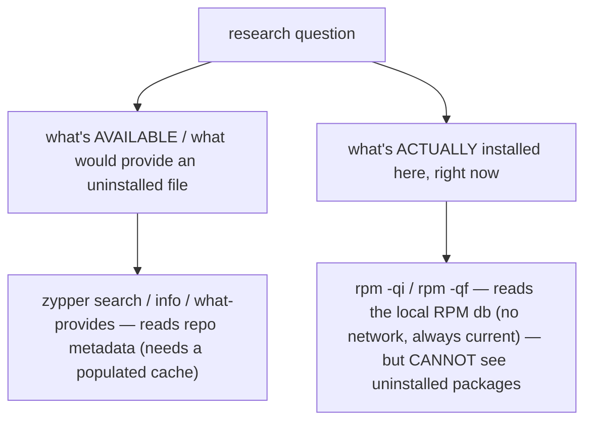

# Part 2 — Installed-only filtering, and the `rpm` fallback

> Prerequisite: [Part 1 — The three research questions: search, info, what-provides](./course-01-the-three-questions.md). Next: [Section 070 quiz](../quiz.md).

The fourth research pattern is the inverse of the first three: not "what is available" but "what is already installed matching this pattern". And underneath zypper, the `rpm` query tools work unchanged — with a structural trade-off worth stating plainly.

## `zypper search --installed-only`

```bash
# shell: inside the zypperbox container
zypper search --installed-only 'python3-*'      # shorthand: zypper se -i 'python3-*'
```

```text
S | Name          | Summary                     | Type
--+---------------+-----------------------------+--------
i | python3-base  | Python 3 interpreter        | package
i | python3-pip   | Python package installer    | package
```

`-i` / `--installed-only` restricts results to packages that are **both** a pattern match **and** currently installed — in one zypper-native command.

It is tempting to mimic the earlier-module habit of `zypper search 'python3-*' | grep`, eyeballing the `S` column. Resist it: zypper gives you the filter natively, and using it directly is faster and less error-prone than scanning a status column across dozens of rows.

## The `rpm` fallback: zero network, zero zypper

openSUSE is RPM-based, so the `rpm -qi` / `rpm -qf` queries from the RPM module work here unchanged:

```bash
rpm -q nginx 2>/dev/null && rpm -qi nginx || echo 'nginx not installed'
rpm -qf /usr/sbin/ip
```



The trade-off is structural, not stylistic:

- **`rpm -qi` / `rpm -qf`** read the local RPM database — no network, exactly what is installed this second. Ceiling: they only ever see what is already on the system.
- **`zypper info` / `zypper what-provides`** read repository metadata — so they can answer "what would an *uninstalled* package provide", which the `rpm` tools structurally cannot.

Use `zypper` for "what is out there"; use `rpm` for "what is genuinely here".

> [!WARNING]
> - **`zypper search '<glob>' | grep -i` for installed packages** → use `zypper se -i '<glob>'`; the native filter is exact and faster.
> - **`rpm -qf` to find an uninstalled package's file** → it only searches installed packages. Use `zypper what-provides`.
> - **`sudo` on any of these** → all read-only.
> - **Trusting `zypper info` with a stale cache** → `zypper refresh` first if freshness matters.

> *`zypper se -i '<glob>'` filters to installed matches natively (no `grep`); `rpm -qi`/`-qf` read the local database with no network but cannot see uninstalled packages, which is exactly what `zypper info`/`what-provides` are for.*

## Reference

- `man zypper` — `search --installed-only` / `-i`, and `--not-installed-only` / `-u`.
- `man rpm` — `-qi`, `-qf`, `-qa`; local-database queries with no network.
- `man zypper` — `search -t pattern` for openSUSE "patterns" (its own group-like meta-objects).
