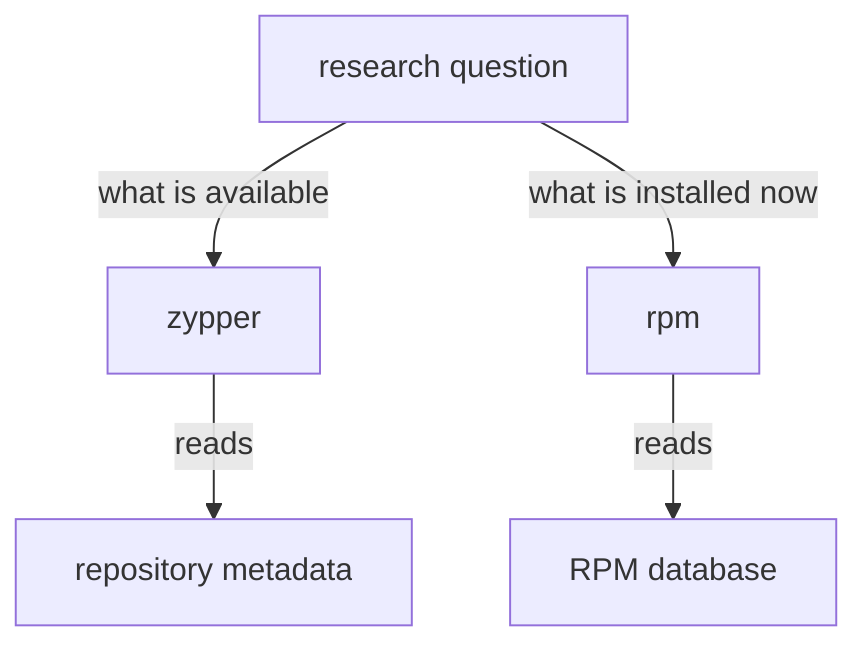

# Installed-Only Search and the rpm Fallback

The fourth research question turns the first three around. It is not "what is available?" but "what is already installed that matches this pattern?". Under `zypper`, the `rpm` query tools also still work, with a trade-off worth stating plainly.

Run every command inside the `zypperbox` container (`docker exec -it zypperbox bash`).

## `zypper search --installed-only`

List installed packages whose names start with `python3-`:

```bash
# shell: inside the zypperbox container
zypper search --installed-only 'python3-*'      # shorthand: zypper se -i 'python3-*'
```

```text
S | Name          | Summary                     | Type
--+---------------+-----------------------------+--------
i | python3-base  | Python 3 interpreter        | package
i | python3-pip   | Python package installer    | package
```

`-i` (long form `--installed-only`) keeps only packages that match the pattern **and** are installed right now, in one `zypper` command. The quotes around `'python3-*'` stop the shell from expanding the `*` before `zypper` sees it. The opposite filter, `-u` (`--not-installed-only`), keeps only packages that are not installed.

It is tempting to run `zypper search 'python3-*' | grep` and scan the `S` column by eye. Do not. `zypper` already has the filter built in, and using it is faster and less likely to go wrong than reading a status column across dozens of rows.

On some `zypper` versions the status column shows `i+` instead of `i` for a package you asked for by name, and plain `i` for one pulled in as a dependency. Both mean "installed".

## The `rpm` fallback: no network, no zypper

openSUSE packages are RPM packages, so the `rpm` query commands work here unchanged. `rpm -qi <name>` prints the details of an installed package, and `rpm -qf <file>` names the installed package that owns a file:

```bash
rpm -q nginx 2>/dev/null && rpm -qi nginx || echo 'nginx not installed'
rpm -qf /usr/sbin/ip
```

The first line prints the details of `nginx` only if it is installed, and otherwise says it is not. The second line names the installed package that owns `/usr/sbin/ip`. `rpm -qa` lists every installed package.

## Which tool reads what

The difference between the two tools comes from where each one looks, not from style.


```mermaid
flowchart TB
    Q["research question"] -->|"what is available"| Z["zypper"]
    Q -->|"what is installed now"| R["rpm"]
    Z -->|"reads"| M["repository metadata"]
    R -->|"reads"| D["RPM database"]
```

The diagram shows that `zypper search`, `info` and `what-provides` read the repository metadata (so they need a refreshed catalogue), while `rpm -qi` and `rpm -qf` read the local RPM database.

- **`rpm -qi` and `rpm -qf`** read the RPM database, the ledger of every crate on board. They need no network and show exactly what is installed this second. Their limit: they can only ever see what is already on the system.
- **`zypper info` and `zypper what-provides`** read repository metadata. So they can answer "what would a package that is not installed provide?", which the `rpm` tools cannot.

Use `zypper` for "what is out there". Use `rpm` for "what is really here". `zypper search -t pattern` also lists openSUSE **patterns**, ready-made bundles of packages for one job (similar to package groups in `dnf`).

In short: `zypper se -i '<pattern>'` filters to installed matches by itself, without `grep`; `rpm -qi` and `rpm -qf` read the local database with no network but cannot see packages that are not installed, which is exactly what `zypper info` and `zypper what-provides` are for.

## Common pitfalls

> [!WARNING]
> - **Using `zypper search '<pattern>' | grep -i` to find installed packages.** Use `zypper se -i '<pattern>'`. The built-in filter is exact and faster.
> - **Using `rpm -qf` to find which package would supply a missing file.** It only searches installed packages. Use `zypper what-provides`.
> - **Running any of these with `sudo`.** They all only read.
> - **Trusting `zypper info` with an old catalogue.** Run `zypper refresh` first if fresh results matter.

## Your mission: Zypper Package Information Lookup Lab

You can now find a package by keyword, read its details, find which package supplies a file, and list installed packages by pattern, all without changing the system. The mission asks you to answer four research questions on an openSUSE host and save each answer to a file, without installing anything.

Start the mission and open a terminal on it:

```sh
astrona run --git git@github.com:astrona-io/ATS002.git -c sections/section-070/module-02/labs/lab-01
astrona ssh ats-002-lab-072
```

Read the task in [`question.md`](./labs/lab-01/question.md) and solve it on your own first. When you think you are done, send it for grading:

```sh
astrona submit -c sections/section-070/module-02/labs/lab-01
```

When the mission is done, remove it:

```sh
astrona destroy ats-002-lab-072
```
