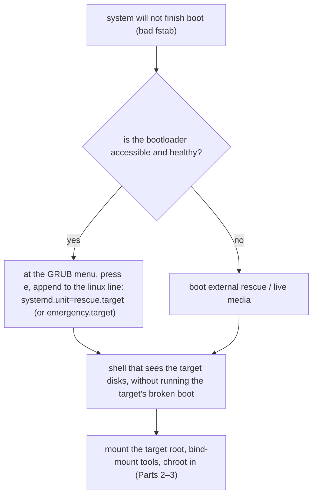

# Part 1 — Why a bad fstab stops the boot, and how to reach a shell

> Prerequisite: [module landing page](./course.md). Next: [Part 2 — Mount the broken root, and get the tools in](./course-02-mount-and-get-tools-in.md).

A single bad `/etc/fstab` line turns a running server into one that will not finish booting. Nothing is damaged — every file is where it was — but systemd will not proceed past a mount it cannot satisfy. This part is the failure mechanism and the two ways to reach a shell that can see the disks without the broken system's own boot succeeding.

## The failure mechanism

On boot, systemd reads `/etc/fstab`, generates a `.mount` unit for every entry, and tries to satisfy them. An entry naming a device that does not exist (a mistyped UUID, a removed disk) produces a mount that can never succeed. systemd waits on it — up to `TimeoutSec` (default 90s for many mounts, sometimes indefinitely for one marked critical) — then, unable to reach `local-fs.target`, drops to **`emergency.target`**: a bare root shell, root filesystem read-only, almost nothing else mounted.

As an analogy (flagged): storage is a filing cabinet, one folder per filesystem; `/etc/fstab` is the master list of which drawer goes in which slot. Mistype one drawer's serial number and the automated retrieval system reaches that entry, cannot find the drawer, and **stops** — refusing to continue past an instruction it cannot fulfil, even though every other drawer is intact and waiting. Where it breaks down: a real clerk would skip the bad line and carry on; systemd is deliberately not that forgiving, because a half-mounted system is often worse than a stopped one.

The fix is not to search for missing files — nothing is missing. It is to correct the one wrong line, which needs access to `/etc/fstab` from *outside* the stuck boot.

## Reaching a shell — two real paths

**Bootloader healthy** — interrupt GRUB, edit the kernel line for this one boot, append `systemd.unit=rescue.target`. `rescue.target` mounts local filesystems and gives a shell without needing every service (including the one hanging on the bad mount) to start. `emergency.target` is more minimal and may not mount local filesystems at all.

**Bootloader broken/inaccessible** — external rescue or live media. From here the steps are identical: both paths land you at a shell that sees the target's disks but is not running the target's own boot.

> [!WARNING]
> - **Trying to "repair" files** → nothing is corrupt; the fix is one line in `/etc/fstab`.
> - **Expecting the boot to skip a bad mount** → it will not; systemd blocks on it, then drops to emergency.
> - **`emergency.target` when you wanted local filesystems mounted** → use `rescue.target`; `emergency` is barer and may leave you to mount everything by hand.
> - **Editing the GRUB line permanently** → the `e`-menu edit is for one boot only; the persistent fix is inside the system (Part 3), not in the boot parameter.

> *A bad `/etc/fstab` entry makes systemd block on an impossible mount and drop to `emergency.target`; reach a working shell via GRUB `systemd.unit=rescue.target` (bootloader healthy) or live media (bootloader broken) — both see the disks without running the broken boot.*

## Reference

- `man systemd.mount` / `man systemd-fstab-generator` — how `/etc/fstab` becomes mount units and what a failed one does to the boot.
- `man systemd.special` — `rescue.target`, `emergency.target`, `local-fs.target` and their differences.
- `man 5 fstab` — the field syntax and the `nofail` / `x-systemd.device-timeout=` options that soften a failure.
