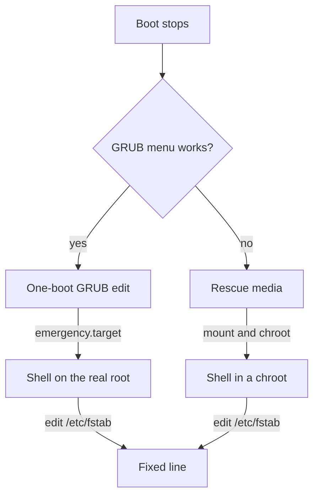

# Why A Bad fstab Stops The Boot

Astronaut, picture a launch sequence that halts because one cargo deck on the list never docks. The other decks are fine and waiting. The ship still refuses to fly. That is what one bad `/etc/fstab` line does to a Linux machine. This part explains why it happens and how to reach a shell that can see the disks when the normal boot cannot finish.

## How one line stops the whole boot

Here is a real example. An administrator adds a new data volume to `/etc/fstab` and mistypes one character of its UUID:

```text
UUID=aabbccdd-5555-6666-7777-8888dead  /data  ext4  defaults  0  2
```

No disk has that UUID. On the next boot, the machine never reaches the login prompt. It stops at an emergency shell instead.

`/etc/fstab` is the list of cargo decks to attach at launch: one line per filesystem, saying which device to mount, where, and as what type. At boot, a systemd helper called `systemd-fstab-generator` reads this file and turns every line into a `.mount` unit. systemd then tries to start each one.

A line that names a device that does not exist can never succeed. systemd waits for the device to appear. By default it gives up after 90 seconds. Then `local-fs.target`, the goal "all local filesystems are mounted", fails, and systemd switches to **`emergency.target`**. That is the emergency bridge with only life support running: a bare root shell, with the root filesystem read-only and almost nothing else mounted.

systemd does not skip the bad line on purpose. A half-mounted system, where programs write into an empty `/data` folder instead of the real disk, is often worse than a stopped one. So the fix is not to search for missing files. Nothing is missing. You correct the one wrong line, and to do that you need to reach `/etc/fstab` from outside the stuck boot.

## Two ways to reach a shell

Which door you use depends on whether the boot menu still works. Both doors end at a shell where you can edit the broken system's `/etc/fstab`.


```mermaid
flowchart TD
    B["Boot stops"] --> Q{"GRUB menu works?"}
    Q -->|"yes"| G["One-boot GRUB edit"]
    Q -->|"no"| M["Rescue media"]
    G -->|"emergency.target"| S["Shell on the real root"]
    M -->|"mount and chroot"| C["Shell in a chroot"]
    S -->|"edit /etc/fstab"| F["Fixed line"]
    C -->|"edit /etc/fstab"| F
```

The diagram shows the two doors: a one-boot edit at the GRUB menu when the bootloader works, and rescue media plus a chroot when it does not.

### When the boot menu works

GRUB is the launch computer that runs before the kernel. At the GRUB menu, highlight the entry, press `e`, and find the line that starts with `linux`. Add one parameter to the end of that line and boot with `Ctrl-X` or `F10`:

```text
systemd.unit=emergency.target
```

This edit lasts for one boot only. Nothing is saved to disk.

`emergency.target` mounts only the root filesystem, read-only, and does not try the other `/etc/fstab` lines. So it does not hang on the bad entry. You are already on the broken system itself, so you do not need a chroot. Make the root filesystem writable with `mount -o remount,rw /`, then fix `/etc/fstab` directly.

You may also read advice to use `systemd.unit=rescue.target`. `rescue.target` starts more of the base system, including the local mounts from `/etc/fstab`. With a broken fstab line it can wait on the same bad mount and then fall back to emergency mode anyway. It is the better door for other problems, when the fstab file is fine and you want your local filesystems mounted for you.

### When the boot menu is broken

If GRUB itself is broken or you cannot reach it, start the machine from rescue media or a live USB stick. That gives you a working system that can see the broken machine's disks. You then mount the broken root filesystem, bring in the tools it needs and step inside it with `chroot`. That is stepping into the damaged ship's bridge from a rescue ship, so its own controls work again.

The rest of this module teaches this second door, because it works in every case. The missions use it too: a stand-in "broken system" sits on a spare disk, and your healthy ship plays the rescue ship.

## Softening a failure in advance

You can tell systemd that a mount is optional. Two options in the fourth field of an fstab line do this:

- `nofail`: if the device is missing, systemd carries on booting without it.
- `x-systemd.device-timeout=` followed by a time: wait only that long for the device instead of the default 90 seconds.

These options are useful for removable or network disks that are not always there. They do not fix a wrong line; they only stop it from blocking the boot. The manual pages `man 5 fstab`, `man systemd.mount` and `man systemd.special` on any Ubuntu machine explain all of this in more detail.

## Common pitfalls

> [!WARNING]
> - **Trying to "repair" files.** Nothing is corrupt. The fix is one line in `/etc/fstab`.
> - **Expecting the boot to skip a bad mount.** It will not. systemd waits on it, then drops to `emergency.target`.
> - **Choosing `rescue.target` for a broken fstab line.** `rescue.target` tries the local mounts and can hang on the same bad entry. For a bad fstab line, `emergency.target` is the door that skips it.
> - **Making the GRUB edit permanent.** The `e` menu edit is for one boot only. The real fix is the corrected line inside the system, not a boot parameter.
