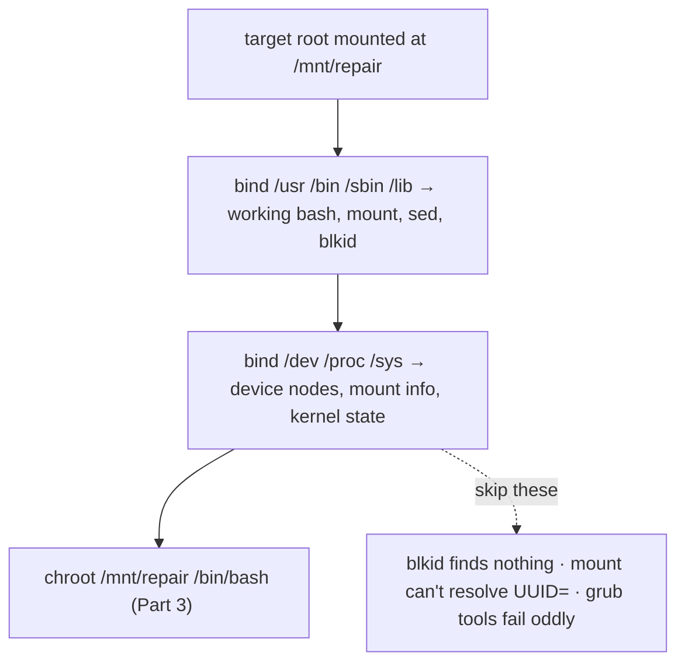

# Part 2 — Mount the broken root, and get the tools in

> Prerequisite: [Part 1 — Why a bad fstab stops the boot, and how to reach a shell](./course-01-why-it-wont-boot-and-reaching-a-shell.md). Next: [Part 3 — chroot in, fix, prove, unmount](./course-03-chroot-fix-prove-unmount.md).

You have a shell that sees the disks. Before you can run the target system's own tools against its own config, you need its root mounted and a working userland plus the kernel interfaces bind-mounted into it. This part is identifying the right partition and assembling a usable chroot.

## Identify the partition — never assume a device name

```bash
# shell: the rescue shell / repair host
lsblk -f
```

```text
NAME    FSTYPE  LABEL         UUID                                   MOUNTPOINT
vda
└─vda1  ext4                  1a2b3c4d-...                           /
vdb
├─vdb1  ext4    DATA001ROOT   9f8e7d6c-1111-2222-3333-444455556666
└─vdb2  ext4    DATA001VOL    aabbccdd-5555-6666-7777-888899990000
```

`lsblk -f` shows device, filesystem type, label, and UUID in one view. Cross-check with `sudo blkid`. In a real incident you may have only UUIDs and disk sizes — which is exactly why the combined view beats guessing `/dev/sdb1`.

Mount the target root:

```bash
sudo mkdir -p /mnt/repair
sudo mount /dev/vdb1 /mnt/repair
```

## Get a working userland in — bind mounts

An empty mount is not a usable chroot. A bare chroot has no `bash`, `mount`, `sed`, or `blkid`. Bind-mount the repair host's own userland into it (read-only is fine):

```bash
sudo mount --bind /usr  /mnt/repair/usr
sudo mount --bind /bin  /mnt/repair/bin
sudo mount --bind /sbin /mnt/repair/sbin
sudo mount --bind /lib  /mnt/repair/lib
[ -e /lib64 ] && sudo mount --bind /lib64 /mnt/repair/lib64
```

`man mount` `--bind`: a bind mount does **not** create a new filesystem — it re-attaches an already-mounted tree at a second location. Nothing is copied; `/mnt/repair/usr` becomes a second doorway to the same files. This gives the chroot working tools while `/mnt/repair/etc` stays the target disk's own `/etc` — broken fstab and all, which is what you are there to fix.

(On a normal full-OS root partition this bind-userland step is unnecessary — the target already has its own `/usr`, `/bin`, etc. It matters when the target carries only config, as this lab's stand-in disk does.)

## Get the kernel interfaces in — the step guides skip

```bash
sudo mount --bind /dev  /mnt/repair/dev
sudo mount --bind /proc /mnt/repair/proc
sudo mount --bind /sys  /mnt/repair/sys
```

Without a populated `/dev` (device nodes), `/proc` (process and mount info), and `/sys` (kernel/device state), tools inside the chroot fail in ways that look unrelated to the missing binds:

- `blkid` finds nothing — there are no device nodes to read.
- `mount` cannot resolve a `UUID=` at all.
- `grub-install`, `update-initramfs` misbehave silently.

**If something inside a chroot fails mysteriously, check these three binds first.**



> [!WARNING]
> - **Guessing `/dev/sdb1` instead of reading `lsblk -f` / `blkid`** → you may mount and edit the wrong disk.
> - **chrooting before bind-mounting `/dev`, `/proc`, `/sys`** → `blkid` returns nothing, `mount -a` cannot resolve UUIDs; the errors do not point at the real cause.
> - **Forgetting `/lib64` on a 64-bit system** → dynamic linker failures for tools inside the chroot. The `[ -e /lib64 ]` guard covers it.
> - **Bind-mounting the target's `/etc` over the real one** → you want the *target's* `/etc` visible in the chroot, i.e. left as whatever the mounted disk provides. Do not bind the host's `/etc` in.

> *Identify the target partition with `lsblk -f` (never a bare device name), mount it, bind-mount `/usr /bin /sbin /lib` for a working userland, then bind-mount `/dev /proc /sys` — skipping the last three makes chroot tools fail in ways that hide the real cause.*

## Reference

- `man mount` — `--bind`, `--rbind`, `-o remount`; what a bind mount is and is not.
- `man lsblk` — `-f` (filesystem view), `-o` custom columns; `man blkid` for the cross-check.
- `arch-chroot(8)` (Arch) / `systemd-nspawn` — tools that automate the bind-mount-then-chroot sequence.
