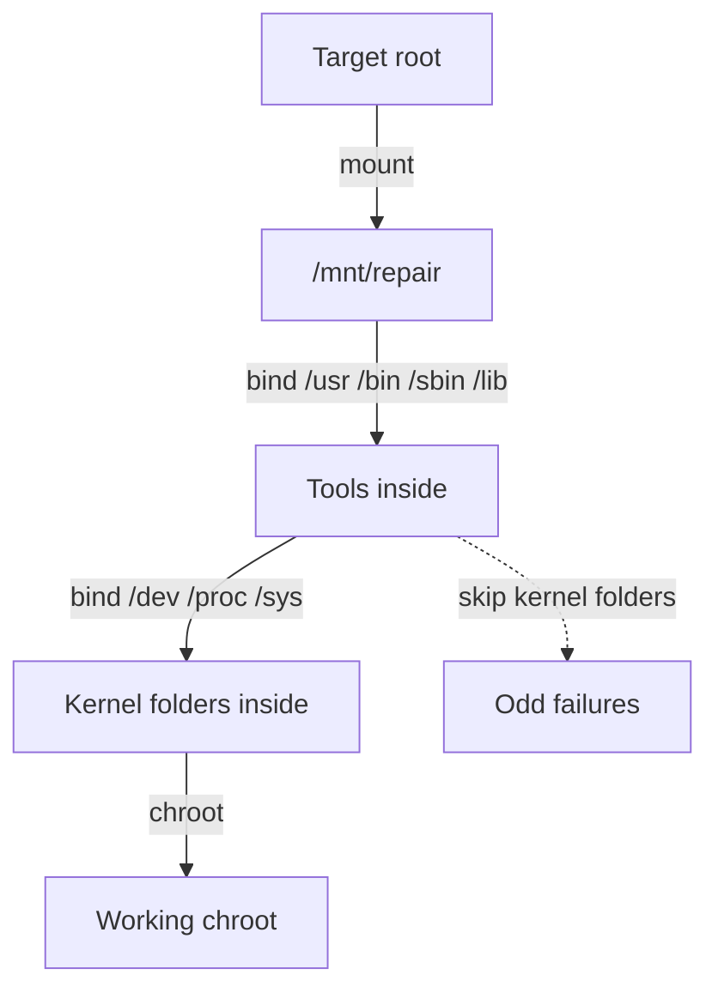

# Mount The Broken Root And Get The Tools In

Astronaut, your rescue ship is docked and you have a shell that can see the broken ship's disks. Before you can step inside, you need three things: the broken root filesystem mounted, a set of working tools inside it, and power cables from your ship for the kernel's own folders. This part builds all three.

In these examples the healthy machine you work from is called the **repair host**. It can be a live USB system, or your own lab ship with the broken system on a spare disk.

## Find the right partition, never guess

The first job is to know exactly which partition holds the broken root filesystem. Run this on the repair host:

```bash
# shell: the rescue shell / repair host
lsblk -f
```

```text
NAME    FSTYPE  LABEL         UUID                                   MOUNTPOINT
vda
└─vda1  ext4                  1a2b3c4d-...                           /
vdb
├─vdb1  ext4    DATA001ROOT   9f8e7d6c-1111-2222-3333-444455556666
└─vdb2  ext4    DATA001VOL    aabbccdd-5555-6666-7777-888899990000
```

This output is a shortened example with made-up UUIDs. On Ubuntu 24.04, `lsblk -f` also shows the `FSVER`, `FSAVAIL` and `FSUSE%` columns and calls the last one `MOUNTPOINTS`, and the main disk usually has more than one partition.

`lsblk -f` shows each device with its filesystem type, label and UUID in one view. `sudo blkid` gives the same facts from another angle, so use it to double-check. The device letters (`vdb`, `sdb`) are handed out in arrival order, like bay numbers at a busy dock, so they can change between boots. Labels, sizes and UUIDs do not. That is why you read this view instead of guessing `/dev/sdb1`.

Here the labels make it clear: `DATA001ROOT` is the broken system's root filesystem and `DATA001VOL` is the data volume its fstab line should mount. Mount the root on an empty folder:

```bash
sudo mkdir -p /mnt/repair
sudo mount /dev/vdb1 /mnt/repair
```

Use your own device name if it is different.

## Bring in a working set of tools

An empty mount is not yet a usable chroot. If the target has no `bash`, `mount`, `sed` or `blkid` of its own, there is nothing to run once you step inside. You can lend it the repair host's tools with bind mounts:

```bash
sudo mount --bind /usr  /mnt/repair/usr
sudo mount --bind /bin  /mnt/repair/bin
sudo mount --bind /sbin /mnt/repair/sbin
sudo mount --bind /lib  /mnt/repair/lib
[ -e /lib64 ] && sudo mount --bind /lib64 /mnt/repair/lib64
```

A **bind mount** does not create a new filesystem and copies nothing. The kernel simply shows a folder that is already mounted at a second place, like a second hatch into the same cargo hold. `/mnt/repair/usr` becomes another door to the repair host's `/usr`. The important part stays untouched: `/mnt/repair/etc` is still the target disk's own `/etc`, broken fstab and all, which is what you came to fix.

On a real, fully installed root partition you can skip this step, because the target already has its own `/usr`, `/bin` and libraries. It matters when the target carries only configuration, as the missions' stand-in disks do.

## Run the power cables: `/dev`, `/proc` and `/sys`

This is the step many guides leave out. Three folders are not ordinary files at all; the kernel fills them while the system runs. Bind-mounting them is like running power cables from the rescue ship into the damaged one:

```bash
sudo mount --bind /dev  /mnt/repair/dev
sudo mount --bind /proc /mnt/repair/proc
sudo mount --bind /sys  /mnt/repair/sys
```

- `/dev` holds the device files, one for each disk and partition.
- `/proc` shows the running processes and what is mounted.
- `/sys` shows the kernel's view of devices and their state.

Without them, tools inside the chroot fail in ways that seem to have nothing to do with the missing folders:

- `blkid` finds nothing, because there are no device files to read.
- `mount` cannot work out which device a `UUID=` line means.
- `grub-install` and `update-initramfs` misbehave without a clear error.


```mermaid
flowchart TD
    T["Target root"] -->|"mount"| R["/mnt/repair"]
    R -->|"bind /usr /bin /sbin /lib"| U["Tools inside"]
    U -->|"bind /dev /proc /sys"| K["Kernel folders inside"]
    K -->|"chroot"| C["Working chroot"]
    U -.->|"skip kernel folders"| F["Odd failures"]
```

The diagram shows the order: mount the target root at `/mnt/repair`, bind in the tools, bind in the kernel folders, then `chroot`. Skipping the kernel folders leads to failures like `blkid` returning nothing.

> [!TIP]
> If anything fails in a strange way inside a chroot, check the `/dev`, `/proc` and `/sys` bind mounts first. They are the most common missing piece.

There are tools that do the bind-then-chroot steps for you, such as `arch-chroot` on Arch Linux and `systemd-nspawn`. Learn the manual steps first, because the exam expects you to know them.

## Common pitfalls

> [!WARNING]
> - **Guessing `/dev/sdb1` instead of reading `lsblk -f` or `blkid`.** You may mount and edit the wrong disk.
> - **Running `chroot` before bind-mounting `/dev`, `/proc` and `/sys`.** `blkid` returns nothing and `mount -a` cannot resolve UUIDs, and the errors do not point at the real cause.
> - **Forgetting `/lib64` on a 64-bit system.** Programs inside the chroot fail to start because their loader is missing. The `[ -e /lib64 ]` check covers it.
> - **Bind-mounting the repair host's `/etc` over the target's.** You want the target's own `/etc` visible inside the chroot, so leave it as the mounted disk provides it.
