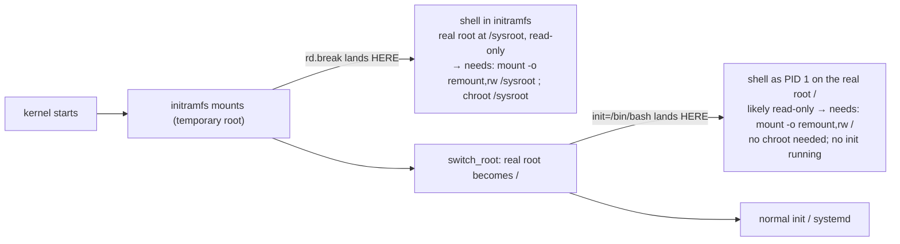

# Part 1 — Two doors: `rd.break` and `init=/bin/bash`

> Prerequisite: [module landing page](./course.md). Next: [Part 2 — The chroot equivalent, and editing `/etc/shadow` directly](./course-02-chroot-equivalent-and-shadow-edit.md).

A locked-out root password is not an unbootable system — the machine boots perfectly, only identity is missing, and there is no other privileged account to `sudo` from. External rescue media works but is overkill. The fast technique: interrupt the bootloader for one boot, edit the kernel command line for that boot only, and land in a root shell before any login prompt. This part is the two parameters that do it and where each drops you.

## The one-boot GRUB edit

At the GRUB menu, highlight the entry, press **`e`**, find the line starting `linux` (or `linuxefi` / `linux16`), append a parameter, boot with `Ctrl-X` / `F10`. Nothing is saved — the next normal reboot reverts to the unmodified entry.

## Where each parameter lands you



As an analogy (flagged): a normal boot is a building with a strict entry procedure — badge check (login), then doors opening in sequence. Both parameters are maintenance entrances that open *before* that procedure, but at two points along the hallway. Where it breaks down: a real maintenance door doesn't change what you must do once inside; these two do — `rd.break` leaves you one `chroot` short of the real filesystem.

### `rd.break`

```
linux  /boot/vmlinuz-... root=/dev/mapper/... rd.break
```

Interrupts **inside the initramfs**, before the real root is switched to `/`. The real root is mounted **read-only at `/sysroot`**:

```bash
mount -o remount,rw /sysroot
chroot /sysroot
passwd root
exit    # leaves the chroot
exit    # resumes the interrupted initramfs boot
```

`mount -o remount,rw` flips an already-mounted filesystem's flags in place — no unmount/mount cycle. The `chroot /sysroot` is what makes `passwd` operate on the real `/etc/shadow`.

### `init=/bin/bash`

```
linux  /boot/vmlinuz-... root=/dev/mapper/... init=/bin/bash
```

Skips init entirely and runs `/bin/bash` as **PID 1**, but only *after* the real root is mounted as `/`. No chroot needed — you are already on the real filesystem. Still likely read-only (making it read-write is normally systemd's job, and no systemd ran):

```bash
mount -o remount,rw /
passwd root
exec /sbin/init      # NOT `reboot` — there is no init to receive the signal
```

`exec /sbin/init` replaces the bare shell with real init and continues to a clean boot.

## The SELinux relabel gotcha

On a system in SELinux `Enforcing` mode, files touched through either path — including `/etc/shadow`, rewritten by `passwd` — can get the wrong or missing security context, because normal boot-time labelling never ran. Flag a relabel before the next boot:

```bash
touch /.autorelabel
```

Early init on the next normal boot sees this file and does a full relabel pass first. Skip it on an enforcing system and SELinux can deny access to the files you just fixed — potentially including login itself. Easy to forget, disproportionately costly.

> [!WARNING]
> - **`rd.break` without `chroot /sysroot`** → `passwd` edits the initramfs's throwaway `/etc/shadow`, not the real one. Nothing persists.
> - **Forgetting `mount -o remount,rw`** (either path) → `passwd` fails writing to a read-only filesystem.
> - **`reboot` after `init=/bin/bash`** → no init to handle it; use `exec /sbin/init`.
> - **Skipping `touch /.autorelabel` on an enforcing SELinux system** → the reset can lock the system out worse than before.

> *`rd.break` drops you in the initramfs with the real root read-only at `/sysroot` (needs `remount,rw` + `chroot`); `init=/bin/bash` drops you on the real root as PID 1 (needs `remount,rw`, no chroot, exit via `exec /sbin/init`) — and on enforcing SELinux, `touch /.autorelabel` first.*

## Reference

- `man 7 dracut.cmdline` — `rd.break` and the `rd.break=` stage variants.
- `man 7 bootup` / `man systemd` — `init=`, the initramfs → `switch_root` → init sequence.
- `man 8 fixfiles` / SELinux docs — `/.autorelabel` and what the relabel pass does.
