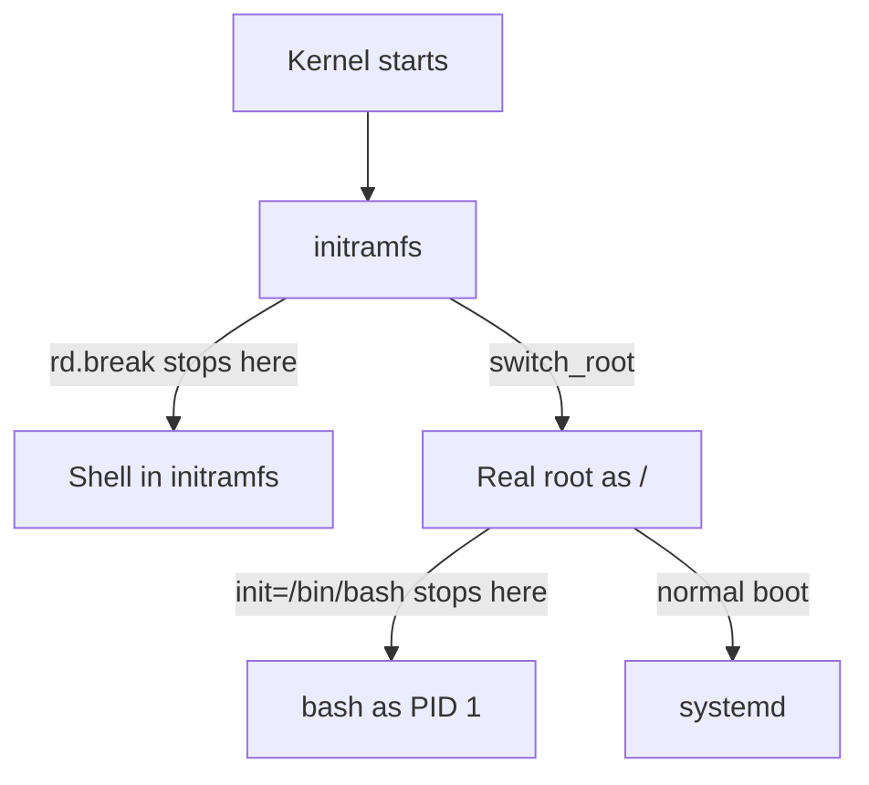

# Two Doors: rd.break And init=/bin/bash

Astronaut, imagine the ship launches fine, but the locked roster of crew passwords, `/etc/shadow`, no longer has a password anyone knows for the captain. You do not need a rescue ship. You need to slip onto the bridge once, before the login check, and write a new password. This part shows the two kernel parameters that open that door and where each one drops you.

This whole part is a worked walkthrough. Both doors need a real console at the GRUB menu, which you cannot reach on the training ships. Read the steps closely: the exam expects you to know them.

## The one-boot GRUB edit

GRUB is the launch computer that starts the kernel. You can change its instructions for one launch without saving anything:

1. At the GRUB menu, highlight the normal entry and press `e`.
2. Find the line that starts with `linux` (on some systems `linuxefi` or `linux16`). It holds the kernel's command line, the start-up instructions handed to the kernel.
3. Add one parameter to the end of that line.
4. Boot with `Ctrl-X` or `F10`.

Nothing is written to disk. The next normal reboot uses the unchanged entry again.

## Where each parameter drops you

A normal boot has two stages. First the kernel starts a small temporary system from the **initramfs**, a starter kit loaded into memory that knows how to find and mount the real root filesystem. Then it switches over to the real root (`switch_root`) and starts the real init program, systemd. The two parameters stop the launch at different points.


```mermaid
flowchart TD
    K["Kernel starts"] --> I["initramfs"]
    I -->|"rd.break stops here"| R["Shell in initramfs"]
    I -->|"switch_root"| S["Real root as /"]
    S -->|"init=/bin/bash stops here"| B["bash as PID 1"]
    S -->|"normal boot"| N["systemd"]
```

The diagram shows that `rd.break` stops inside the initramfs, before the real root becomes `/`, while `init=/bin/bash` stops after the switch, in place of systemd. With `rd.break` the real root waits read-only at `/sysroot`; with `init=/bin/bash` you are already on it, probably read-only too.

Think of it as two maintenance hatches on the way to the bridge. Both open before the login check. But `rd.break` leaves you one step short: you still have to step through into the real ship with `chroot`.

### `rd.break`

`rd.break` belongs to **dracut**, the tool that builds the initramfs on RHEL-family systems such as Rocky Linux and Fedora. Ubuntu builds its initramfs with a different tool, `initramfs-tools`, which does not know `rd.break`. That is one more reason this door is a walkthrough here. The edited kernel line looks like this:

```
linux  /boot/vmlinuz-... root=/dev/mapper/... rd.break
```

The boot stops inside the initramfs, before the real root becomes `/`. The real root is mounted **read-only at `/sysroot`**:

```bash
mount -o remount,rw /sysroot
chroot /sysroot
passwd root
exit    # leaves the chroot
exit    # resumes the interrupted initramfs boot
```

`mount -o remount,rw` changes the flags of a filesystem that is already mounted, from read-only to read-write, without unmounting it. `chroot /sysroot` is what makes `passwd` change the real `/etc/shadow` instead of the initramfs copy. The first `exit` leaves the chroot, and the second one lets the paused boot carry on.

### `init=/bin/bash`

`init=/bin/bash` works on almost any Linux, Ubuntu included. The edited kernel line looks like this:

```
linux  /boot/vmlinuz-... root=/dev/mapper/... init=/bin/bash
```

The kernel mounts the real root as `/` as usual, but then runs `/bin/bash` as **PID 1**, the very first process, instead of systemd. You need no chroot, because you are already on the real filesystem. The root filesystem is probably still read-only: making it read-write is normally systemd's job, and systemd never ran.

```bash
mount -o remount,rw /
passwd root
exec /sbin/init      # NOT `reboot` — there is no init to receive the signal
```

`reboot` does not work here, because it asks systemd to restart the machine and there is no systemd running. `exec /sbin/init` replaces the bare shell with the real init program, and the boot carries on to a normal start.

## The SELinux relabel step

SELinux sticks a security tag, called a label or context, on every file and every process. Its rules compare tags, not paths. Some systems, mostly in the RHEL family, run SELinux in `Enforcing` mode. Ubuntu uses AppArmor instead, so this step does not apply to the training ships.

When you change files through either door, normal boot-time labelling never ran. So `/etc/shadow`, freshly rewritten by `passwd`, can end up with a wrong or missing label. Before you leave, ask for a full relabel on the next boot:

```bash
touch /.autorelabel
```

Early in the next normal boot, the system sees this empty file and relabels every file before anything else starts. Skip it on an enforcing system, and SELinux can block access to the files you just fixed, which may include the login itself. It is easy to forget and very costly when you do.

## Common pitfalls

> [!WARNING]
> - **`rd.break` without `chroot /sysroot`.** `passwd` then changes the initramfs's temporary `/etc/shadow`, not the real one. Nothing is kept.
> - **Forgetting `mount -o remount,rw`** on either path. `passwd` fails because it cannot write to a read-only filesystem.
> - **Typing `reboot` after `init=/bin/bash`.** There is no init to handle it. Use `exec /sbin/init`.
> - **Skipping `touch /.autorelabel` on an enforcing SELinux system.** The reset can lock the system out worse than before.
> - **Trying `rd.break` on Ubuntu.** It is a dracut parameter. On Ubuntu use `init=/bin/bash`.
