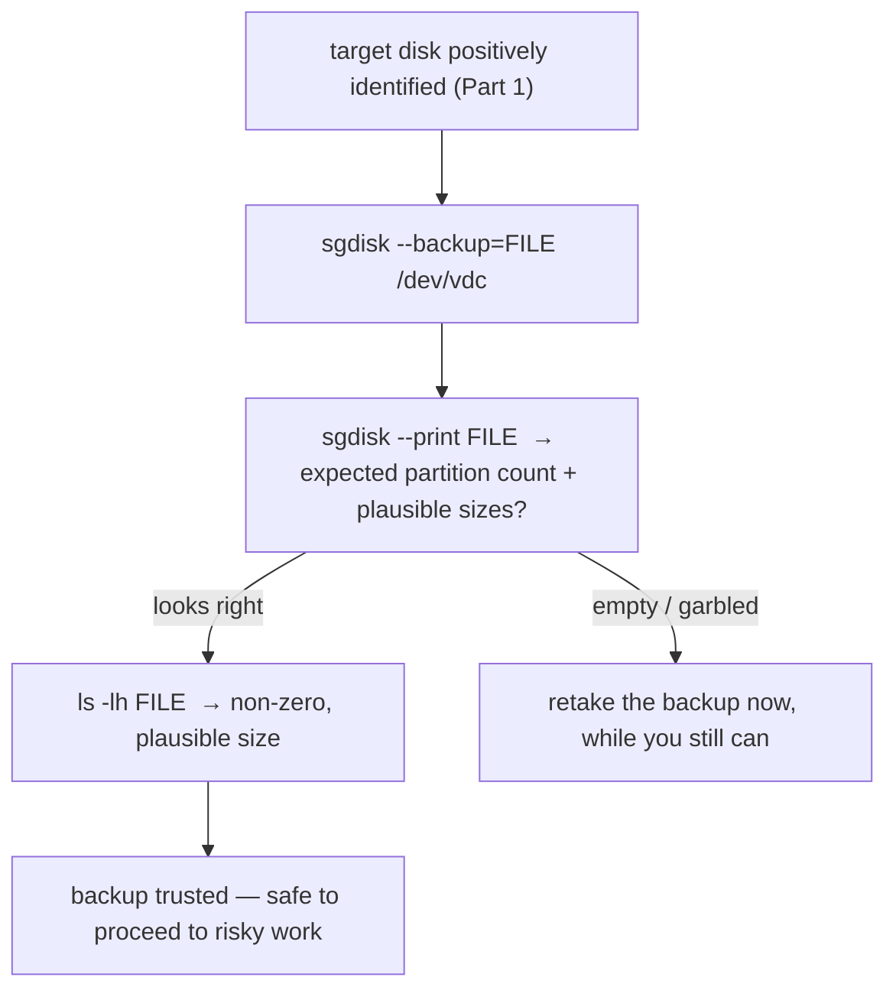

# Part 2 — Back up the partition table, and verify the backup

> Prerequisite: [Part 1 — Two layers, not one, and identifying the target disk](./course-01-two-layers-and-identifying-the-disk.md). Next: [Part 3 — Simulate, restore, and verify both layers](./course-03-simulate-restore-verify.md).

The professional fix for partition-table loss is preventive: capture the table *before* running anything risky, so a mistake is a two-minute restore instead of a data-recovery emergency. This part is the backup command for GPT (and the MBR contrast), and — the step people skip — verifying the backup is actually sane.

## Back up the GPT table

```bash
# shell: repair host, root
sudo sgdisk --backup=/root/vdc-ptable-backup.bin /dev/vdc
```

`man sgdisk` `--backup`: writes a binary snapshot of the **GPT header and the full partition entry array** — every partition's exact start/end sector, type GUID, and unique GUID — to the file. Structural only: **no file data from inside the partitions**, by design. Its only job is letting the exact layout be reconstructed later.

## The MBR contrast

For a legacy MBR disk the equivalents are different tools:

```bash
sudo sfdisk -d /dev/vdX > /root/vdX-ptable-backup.txt        # plain-text, editable; works for MBR and GPT
sudo dd if=/dev/vdX of=/root/vdX-mbr-backup.img bs=512 count=1  # raw first sector only
```

`sfdisk -d` produces a human-readable, editable description and handles both table types, though `sgdisk` is more GPT-native. The raw `dd` form captures only the literal first 512 bytes — enough for a pure MBR table, but it does **not** capture GPT's structures, which live beyond that first sector (and a backup GPT header at the very end of the disk).

## Verify the backup — before you need it

```bash
sudo sgdisk --print /root/vdc-ptable-backup.bin
```

`sgdisk` treats a backup file like a device for reads — `--print` parses and displays it exactly as it would the live disk. Confirm the expected number of partitions with plausible sizes matching Part 1's `lsblk -f`.

```bash
ls -lh /root/vdc-ptable-backup.bin      # a plausible non-zero size
```

An empty, truncated, or garbled backup shows up **here** — far better than discovering it mid-emergency when it is too late to take a fresh one.



> [!WARNING]
> - **Assuming `sgdisk --backup` includes file data** → it does not; it is the table structure only. Filesystem backups are a separate concern.
> - **Using raw `dd` of sector 0 for a GPT disk** → misses the GPT entry array and the backup header. Use `sgdisk --backup` (or `sfdisk -d`) for GPT.
> - **Skipping `sgdisk --print` on the backup file** → a corrupt backup is discovered only when you try to restore from it under pressure.
> - **Writing the backup onto the same disk you are about to risk** → put it elsewhere (`/root` on the OS disk, or off-box).

> *`sgdisk --backup=FILE /dev/DISK` captures the GPT header and partition entry array (no file data); verify it immediately with `sgdisk --print FILE` and a size check — a corrupt backup found now is fixable, found mid-restore is not.*

## Reference

- `man sgdisk` — `--backup`, `--load-backup`, `--print`; GPT header + entry array.
- `man sfdisk` — `-d` dump / restore-by-redirect; works for MBR and GPT.
- `man dd` — `bs=512 count=1` first-sector capture and its limits for GPT.
