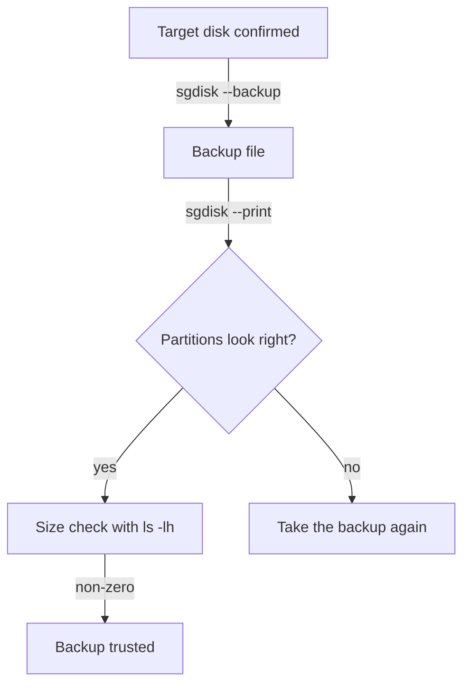

# Back Up And Verify The Partition Table

Astronaut, the best moment to save a deck plan is before anything goes wrong. A copy kept in another ship's safe turns a wiped partition table into a two-minute restore instead of a data recovery emergency. This part shows the backup command for GPT disks, the tools for older MBR disks, and the step people skip: checking that the backup is actually good.

## Back up a GPT table with `sgdisk`

`sgdisk` is the script-friendly member of the GPT fdisk tools (`gdisk`, `sgdisk`). It works on GPT disks. Run it as root against the whole disk, not a partition:

```bash
# shell: repair host, root
sudo sgdisk --backup=/root/vdc-ptable-backup.bin /dev/vdc
```

Use your own disk's name; the extra disk is often `/dev/vdb`.

`--backup` writes a small binary file holding the protective MBR, both GPT headers and one copy of the partition entries. That is every partition's exact start and end sector, its type ID and its unique ID. It holds **no file data from inside the partitions**, on purpose. Its only job is to let you rebuild the exact layout later.

Keep the backup off the disk you are about to risk. `/root` on the main system disk works for practice; on a real system, copy it to another machine too.

## Tools for older MBR disks

An MBR disk (Master Boot Record, the older format) needs different tools:

```bash
sudo sfdisk -d /dev/vdX > /root/vdX-ptable-backup.txt        # plain-text, editable; works for MBR and GPT
sudo dd if=/dev/vdX of=/root/vdX-mbr-backup.img bs=512 count=1  # raw first sector only
```

`sfdisk -d` writes a plain-text description you can read and edit. It works for both MBR and GPT, and you restore it later by feeding the file back into `sfdisk`. `sgdisk` is still the more natural tool for GPT.

The raw `dd` form copies only the first 512 bytes of the disk. That is enough for a pure MBR table, but it does **not** capture a GPT table. GPT keeps its structures after that first sector, and its second copy at the very end of the disk.

## Check the backup before you need it

A backup you have never looked at is only a hope. `sgdisk` can read the backup file the same way it reads a disk:

```bash
sudo sgdisk --print /root/vdc-ptable-backup.bin
```

`--print` shows the partition list. Check that it has the expected number of partitions and that their sizes match what `lsblk -f` showed for the disk.

```bash
ls -lh /root/vdc-ptable-backup.bin      # a plausible non-zero size
```

An empty, cut-short or garbled backup shows up **here**, while you can still take a fresh one. Finding it in the middle of an emergency is too late.


```mermaid
flowchart TD
    ID["Target disk confirmed"] -->|"sgdisk --backup"| BK["Backup file"]
    BK -->|"sgdisk --print"| PR{"Partitions look right?"}
    PR -->|"yes"| SZ["Size check with ls -lh"]
    PR -->|"no"| RE["Take the backup again"]
    SZ -->|"non-zero"| OK["Backup trusted"]
```

The diagram shows the order: confirm the disk, take the backup, read it back with `sgdisk --print`, check its size, and only then trust it. If the printout looks wrong, take the backup again straight away.

## Common pitfalls

> [!WARNING]
> - **Thinking `sgdisk --backup` saves your files.** It saves only the table. Backing up the data inside is a separate job.
> - **Using a raw `dd` of the first sector for a GPT disk.** It misses the GPT entries and the second copy at the end of the disk. Use `sgdisk --backup` or `sfdisk -d`.
> - **Skipping `sgdisk --print` on the backup file.** A bad backup is then found only when you try to restore from it under pressure.
> - **Writing the backup onto the disk you are about to risk.** Keep it somewhere else: `/root` on the system disk, or another machine.
