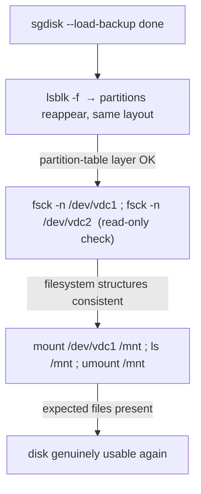

# Part 3 — Simulate, restore, and verify both layers

> Prerequisite: [Part 2 — Back up the partition table, and verify the backup](./course-02-backup-and-verify.md). Next: [Section 080 quiz](../quiz.md).

With a verified backup you can deliberately destroy the table and restore it — proving the whole cycle works. This part is the destructive step (with its safety ritual), the restore, and the two-layer verification that a restored table alone does not give you.

## Simulate the disaster — on a disposable disk only

> **This step is genuinely destructive.** Run it only against a disk whose identity you have just re-confirmed, never against one you cannot afford to lose.

```bash
# shell: repair host, root
lsblk -f            # re-confirm the target ONE MORE TIME, immediately before

sudo sgdisk --zap-all /dev/vdc
```

`--zap-all` destroys both the GPT structures and any protective MBR. Outside a lab there is no legitimate reason to run this on a disk you did not intend to fully wipe.

```bash
lsblk -f            # /dev/vdc now shows no partitions
```

The floor markings are gone; the inventory where `vdc1`/`vdc2` lived is still physically on the disk, just unreachable.

## Restore from the backup

```bash
sudo sgdisk --load-backup=/root/vdc-ptable-backup.bin /dev/vdc
```

`--load-backup` writes the saved GPT header and partition entry array back, recreating the exact boundaries, types, and GUIDs from backup time.

## Verify BOTH layers



```bash
lsblk -f                          # table layer: partitions back, same layout
sudo fsck -n /dev/vdc1            # filesystem layer: read-only consistency check
sudo fsck -n /dev/vdc2
sudo mount /dev/vdc1 /mnt && ls /mnt && sudo umount /mnt   # concrete proof: data readable
```

`fsck -n` checks without repairing — a safe first look. A successful mount plus the expected original files is the most concrete proof: data is genuinely readable, not just structurally plausible. **Restoring the boundaries and the filesystem inside being healthy are two separate facts** (Part 1's warehouse); only checking both proves the disk is usable.

> [!WARNING]
> - **`sgdisk --zap-all` without re-checking the device immediately before** → the one command that wipes the wrong disk if you relied on a check from earlier in the session.
> - **Declaring success at `lsblk` showing partitions** → that is only the table layer. Run `fsck -n` and a mount test.
> - **`fsck` without `-n` on a first look** → let it be read-only until you have seen what it reports.
> - **Restoring a backup to the wrong disk** → `--load-backup` overwrites the target's table. Confirm `/dev/vdc` is right.

> *After `sgdisk --zap-all` (re-confirm the device first) and `sgdisk --load-backup`, verify the table layer with `lsblk -f` **and** the filesystem layer with `fsck -n` plus a mount-and-list — a reappearing partition says nothing about the filesystem inside it.*

## Reference

- `man sgdisk` — `--zap-all`, `--load-backup`, `--verify`.
- `man fsck` — `-n` (no changes), `-y`, `-f` (force); reading the consistency report.
- `man mount` — a real mount-and-inspect as the final proof of readability.
