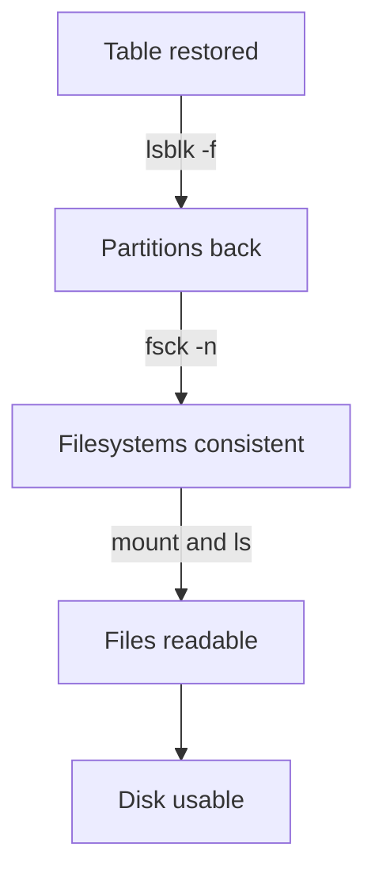

# Wipe, Restore And Verify Both Layers

Astronaut, a backup you have never restored is untested. With a checked backup in the safe, you can now destroy the deck plan on purpose and bring it back, proving the whole cycle works. This part covers the destructive step and its safety habit, the restore, and the two separate checks that prove the disk is really usable again.

The commands below assume a GPT disk at `/dev/vdc` and a checked backup at `/root/vdc-ptable-backup.bin`. Use your own disk's name.

## Wipe the table, on a disposable disk only

This step really destroys the partition table. Run it only against a disk you have just identified again, and never against one you cannot afford to lose.

```bash
# shell: repair host, root
lsblk -f            # re-confirm the target ONE MORE TIME, immediately before

sudo sgdisk --zap-all /dev/vdc
```

`--zap-all` destroys the GPT structures at both ends of the disk and the protective MBR. Outside a practice disk, there is no good reason to run it on a disk you did not mean to wipe completely.

```bash
lsblk -f            # /dev/vdc now shows no partitions
```

The deck plan is gone. The cargo where `vdc1` and `vdc2` lived is still physically on the disk, but nothing can find it.

## Restore from the backup

```bash
sudo sgdisk --load-backup=/root/vdc-ptable-backup.bin /dev/vdc
```

`--load-backup` writes the saved headers and partition entries back to the disk. It recreates the exact boundaries, types and IDs from the moment you took the backup. `sgdisk` then asks the kernel to read the new table, so the partitions come back as device files.

## Verify both layers

A restored table is only the first layer. The checks below test each layer on its own, from the boundaries down to the files.


```mermaid
flowchart TD
    R["Table restored"] -->|"lsblk -f"| L1["Partitions back"]
    L1 -->|"fsck -n"| L2["Filesystems consistent"]
    L2 -->|"mount and ls"| L3["Files readable"]
    L3 --> OK["Disk usable"]
```

The diagram shows the three checks in order: the partitions reappear, the filesystems inside pass a read-only check, and a test mount shows the real files.

### Check the table and the filesystems

Run the checks one layer at a time:

```bash
lsblk -f                          # table layer: partitions back, same layout
sudo fsck -n /dev/vdc1            # filesystem layer: read-only consistency check
sudo fsck -n /dev/vdc2
sudo mount /dev/vdc1 /mnt && ls /mnt && sudo umount /mnt   # concrete proof: data readable
```

`fsck` is the filesystem checker. The `-n` option makes it answer "no" to every repair question, so it only looks and changes nothing. That makes it a safe first look. A clean `fsck -n` means the filesystem structures are consistent.

A successful mount that shows the files you expect is the strongest proof: the data can really be read, not just look right on paper. Check the second partition the same way.

### Why both checks matter

Getting the boundaries back and having a healthy filesystem inside are two separate facts. A deck plan can be perfect while the cargo inside one deck is damaged. Only when both checks pass can you call the disk usable again.

## Common pitfalls

> [!WARNING]
> - **Running `sgdisk --zap-all` without checking the device again right before.** This is the one command that wipes the wrong disk if you trusted a check from earlier in the session.
> - **Declaring success because `lsblk` shows partitions.** That is only the table layer. Run `fsck -n` and a test mount.
> - **Running `fsck` without `-n` for a first look.** Keep it read-only until you have seen what it reports.
> - **Restoring a backup to the wrong disk.** `--load-backup` overwrites the target's table. Confirm the disk name first.

## Your mission: Partition Table Backup & Recovery Lab

You can now back up a GPT partition table, check the backup, restore it after a wipe and verify both layers. The mission asks you to run that full cycle on a secondary disk whose two partitions each hold a file that must survive.

Start the mission and open a terminal on it:

```sh
astrona run --git git@github.com:astrona-io/ATS002.git -c sections/section-080/module-03/labs/lab-01
astrona ssh ats-002-lab-083
```

Read the task in [`question.md`](./labs/lab-01/question.md) and solve it on your own first. When you think you are done, send it for grading:

```sh
astrona submit -c sections/section-080/module-03/labs/lab-01
```

When the mission is done, remove it:

```sh
astrona destroy ats-002-lab-083
```
