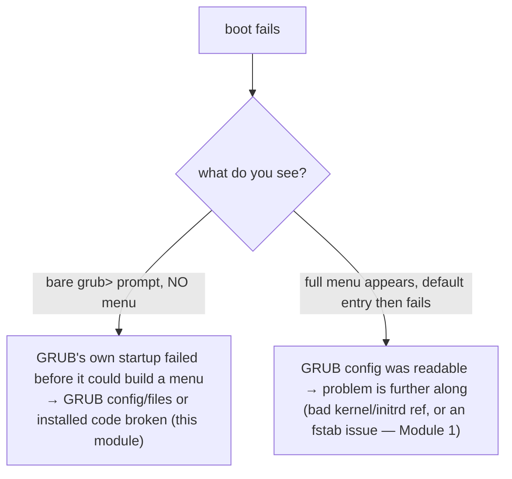

# Part 1 — Two repairs, easy to confuse, and reading the symptom

> Prerequisite: [module landing page](./course.md). Next: [Part 2 — The one-boot manual rescue from `grub>`](./course-02-manual-rescue-from-grub.md).

GRUB failures need one or both of two repairs, and the tools for them sound interchangeable but are not. This part is that distinction and how to tell a broken-GRUB symptom from a problem one layer further along.

## `grub-install` vs `update-grub` — different jobs

| Tool | Writes | Assumes |
|---|---|---|
| **`grub-install`** (`grub2-install` on RHEL/openSUSE) | GRUB's actual **boot-sector or EFI executable code** — the first tiny program the firmware runs | nothing; this *establishes* GRUB on the disk |
| **`update-grub`** (`grub2-mkconfig -o …` on RHEL/openSUSE) | the **menu configuration file** — boot entries, kernel/initrd parameters (`/boot/grub/grub.cfg` Debian, `/boot/grub2/grub.cfg` RHEL) | GRUB's installed code is already present and working |

As an analogy (flagged): a stage play. `grub-install` builds the **stage** — the structure that must exist before any performance. `update-grub` writes the **night's programme** — which acts, in what order. A missing programme in front of a good stage leaves the audience with nothing to watch; a beautiful programme in front of a stage torn down overnight is equally useless. Where it breaks down: a stage is rebuilt rarely, but you regenerate the GRUB config on every kernel update.

`update-grub` on Debian/Ubuntu is not a simpler tool — it is a thin wrapper calling the same `grub-mkconfig` machinery RHEL invokes directly, with the right output path baked in.

**A fully broken GRUB needs both repaired. A narrow problem (config missing, boot code intact) needs only the config.** Running both every time is the safe habit — a config rebuilt on top of broken boot code still will not boot.

## Reading the symptom

```
error: no such device: ...
error: unknown filesystem.
Entering rescue mode...
grub>
```



A **bare `grub>` prompt with no menu** means GRUB's early startup failed before it could even build a menu — its config or installed files are the problem. A **menu that displays but whose entry fails** means the config was fine; the fault is one layer deeper.

> [!WARNING]
> - **Running only `update-grub` on a fully broken GRUB** → a fresh config on top of missing boot code still will not boot. Run `grub-install` too.
> - **Running only `grub-install`** → the boot code is back but the menu is not regenerated for current kernels. Run `update-grub` too.
> - **Treating a failing *menu entry* as this module's problem** → a visible menu means the config loaded; look further along (Module 1).
> - **Assuming Debian and RHEL command names are the only difference** → they call the same `grub-mkconfig` core; the output path and package name differ.

> *`grub-install` writes GRUB's boot-sector/EFI code (the stage); `update-grub` / `grub2-mkconfig` writes the menu config (the programme) — a bare `grub>` prompt points at broken GRUB itself, and a full repair runs both tools.*

## Reference

- `man grub-install` / `man grub-mkconfig` — what each writes and where.
- `info grub` "Installing GRUB" and "Simple configuration" — the boot-code vs config-file split in full.
- GRUB rescue docs — the meaning of `error: no such device` / `unknown filesystem` at the `grub>` prompt.
