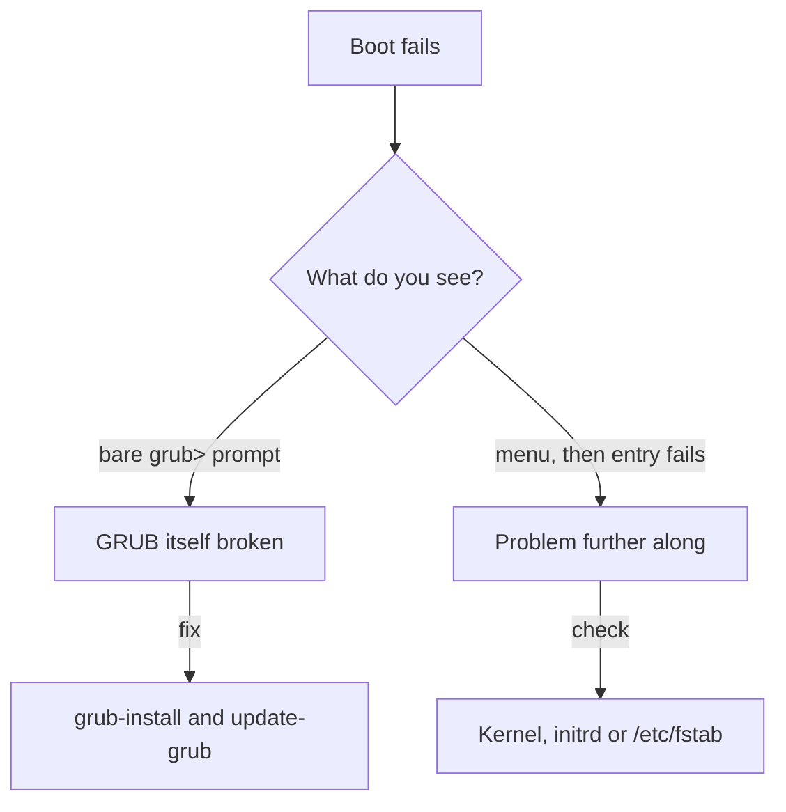

# Two Repairs And Reading The Symptom

Astronaut, a broken launch computer can need one of two repairs, or both. The tools for them have similar names but do very different jobs. This part sets out that difference and shows how to tell a broken GRUB from a problem one step further along the launch sequence.

## `grub-install` and `update-grub` do different jobs

Here are the two tools side by side:

| Tool | Writes | Assumes |
|---|---|---|
| **`grub-install`** (`grub2-install` on RHEL/openSUSE) | GRUB's actual **boot-sector or EFI executable code** — the first tiny program the firmware runs | nothing; this *establishes* GRUB on the disk |
| **`update-grub`** (`grub2-mkconfig -o …` on RHEL/openSUSE) | the **menu configuration file** — boot entries, kernel/initrd parameters (`/boot/grub/grub.cfg` Debian, `/boot/grub2/grub.cfg` RHEL) | GRUB's installed code is already present and working |

In the ship picture, `grub-install` fits the launch computer itself into the ship. `update-grub` writes the launch checklist that computer reads: which kernels to offer and with which settings. A fine checklist does nothing without a working launch computer. A working launch computer with no checklist drops to the `grub>` prompt. You rewrite the checklist often, on every kernel update, but you rarely need to refit the computer.

`update-grub` on Debian and Ubuntu is not a simpler tool. It is a short wrapper that runs `grub-mkconfig -o /boot/grub/grub.cfg`, the same program RHEL-family systems run as `grub2-mkconfig`, with the right output path filled in.

**A fully broken GRUB needs both repairs. A narrow problem, where the menu file is missing but the boot code is fine, needs only the menu file.** Running both every time is the safe habit: a new menu file on top of broken boot code still will not boot.

## Reading the symptom

The screen at boot tells you which layer failed. A broken GRUB often shows something like this:

```
error: no such device: ...
error: unknown filesystem.
Entering rescue mode...
grub>
```


```mermaid
flowchart TD
    S["Boot fails"] --> Q{"What do you see?"}
    Q -->|"bare grub> prompt"| A["GRUB itself broken"]
    Q -->|"menu, then entry fails"| B["Problem further along"]
    A -->|"fix"| G["grub-install and update-grub"]
    B -->|"check"| K["Kernel, initrd or /etc/fstab"]
```

The diagram shows the split: a bare `grub>` prompt points at GRUB itself, while a menu that appears and then fails points at something later in the boot.

A **bare `grub>` prompt with no menu** means GRUB's early start-up failed before it could even build a menu. Its configuration or its installed files are the problem.

A **menu that appears, but whose entry then fails**, means GRUB read its configuration fine. The fault is one layer deeper: a wrong kernel or initrd path in the entry, or a later problem such as a bad `/etc/fstab` line that stops systemd.

## Common pitfalls

> [!WARNING]
> - **Running only `update-grub` on a fully broken GRUB.** A fresh menu file on top of missing boot code still will not boot. Run `grub-install` too.
> - **Running only `grub-install`.** The boot code is back, but the menu file is not rebuilt for the current kernels. Run `update-grub` too.
> - **Treating a failing menu entry as a broken GRUB.** A visible menu means the configuration loaded. Look further along the boot.
> - **Thinking the Debian and RHEL commands are different tools.** Both run the same `grub-mkconfig` program; only the command name, the package name and the output path differ.
