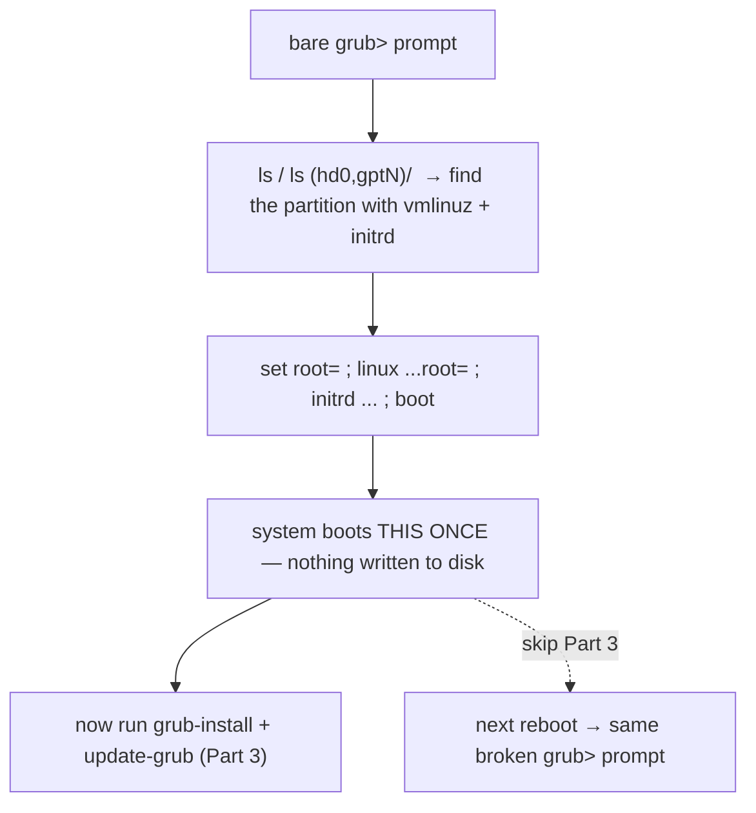

# Part 2 — The one-boot manual rescue from `grub>`

> Prerequisite: [Part 1 — Two repairs, easy to confuse, and reading the symptom](./course-01-two-repairs-and-the-symptom.md). Next: [Part 3 — The durable repair: reinstall and regenerate](./course-03-durable-repair.md).

Stuck at a bare `grub>` prompt, GRUB's own built-in shell has just enough to hand-assemble one boot and get back into the system. This part is that sequence — and why it is a way *in*, not a fix.

## Find the boot partition by hand

```text
grub> ls
(hd0) (hd0,gpt2) (hd0,gpt1)

grub> ls (hd0,gpt2)/
lost+found/ grub/ vmlinuz-6.8.0-... initrd.img-6.8.0-...img ...
```

`ls` alone lists devices in GRUB's naming (`(hdN,gptM)`). `ls (hd0,gptM)/` lists that partition's contents. Iterate through candidates until one holds recognisable boot artefacts — `vmlinuz-*`, `initrd.img-*`, a `grub/` directory. This is how you locate the right partition with **zero prior assumptions** about disk layout, which matters precisely because the config that would have told you is what is missing.

## Hand-assemble one boot

```text
grub> set root=(hd0,gpt2)
grub> linux (hd0,gpt2)/vmlinuz-6.8.0-... root=/dev/vda1
grub> initrd (hd0,gpt2)/initrd.img-6.8.0-...img
grub> boot
```

- **`set root=(hd0,gptN)`** — the partition subsequent bare paths are relative to.
- **`linux <path> root=<dev>`** — the kernel and its command line; the `root=` here is the **real root device** (`/dev/vda1`, `/dev/mapper/...`), a different thing from GRUB's `root`.
- **`initrd <path>`** — the matching initramfs. **Mismatch the kernel and initrd versions and the boot commonly fails** or drops to its own emergency shell.
- **`boot`** — start this hand-built config.

## This is a door, not a fix



Nothing in this sequence is written to disk. The moment the machine reboots, GRUB starts again from the broken state. It gets you a working shell for one session so you can run the durable repair in Part 3 — that is all.

This console sequence is exactly what an SSH-only grading harness cannot exercise (there is no console to type into). Know it for the exam; the hands-on lab picks up at Part 3, which is identical whether you reached a shell this way or the system booted on its own.

> [!WARNING]
> - **Treating a successful manual boot as the repair** → nothing persisted; the next reboot is back to `grub>`. Run Part 3.
> - **Kernel and initrd from different versions** → `linux vmlinuz-6.8.0-31` with `initrd initrd.img-6.8.0-29` typically fails. Match them.
> - **Confusing GRUB's `root=` with the kernel's `root=`** → `set root=(hd0,gpt2)` is where GRUB reads files; `linux ... root=/dev/vda1` is where the kernel mounts `/`. Both are needed and they differ.
> - **Guessing the partition instead of using `ls`** → `ls (hd0,gptN)/` on each candidate; do not assume `gpt1` is `/boot`.

> *At a bare `grub>` prompt, `ls` then `ls (hd0,gptN)/` locate the partition with `vmlinuz`/`initrd`, and `set root=` / `linux …root=<realdev>` / `initrd` / `boot` hand-assemble one boot — none of it persists, so it is only a way in to run the Part 3 repair.*

## Reference

- `info grub` "GRUB only offers a rescue shell" — the `ls` / `set root` / `linux` / `initrd` / `boot` recovery sequence.
- `man grub` / GRUB command reference — `insmod normal`, `configfile` as an alternative when `grub.cfg` exists but was not auto-loaded.
- `man 7 bootup` — kernel `root=` vs bootloader device selection.
