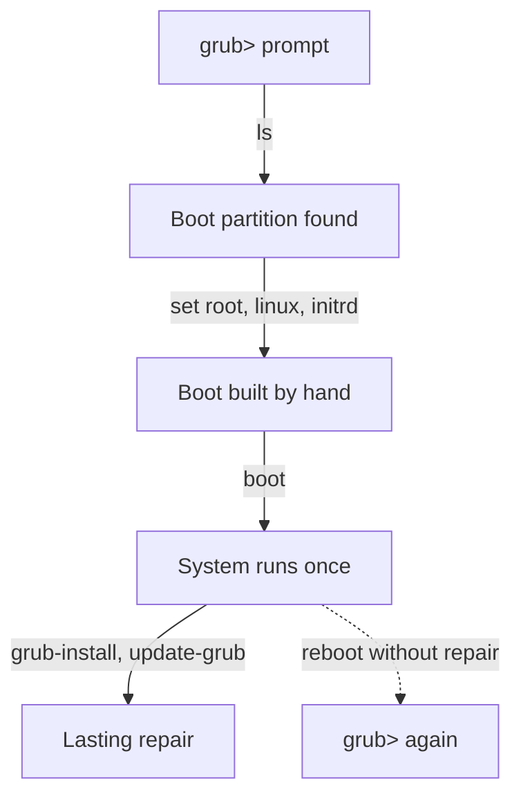

# The One-Boot Rescue From grub>

Astronaut, the launch computer has lost its checklist and sits at a bare `grub>` prompt. It still understands typed orders. With a handful of commands you can tell it where the kernel is and launch the ship once, by hand. This part shows that sequence, and why it is only a way back in, not a fix.

This whole part is a worked walkthrough. It needs a real console during boot, which you cannot reach on the training ships. The exam expects you to know it, so read each step closely.

## Find the boot files by hand

GRUB names disks and partitions its own way: `(hd0)` is the first disk and `(hd0,gpt2)` is the second GPT partition on it. Start by listing what GRUB can see, then look inside one partition:

```text
grub> ls
(hd0) (hd0,gpt2) (hd0,gpt1)

grub> ls (hd0,gpt2)/
lost+found/ grub/ vmlinuz-6.8.0-... initrd.img-6.8.0-...img ...
```

This output is shortened. A real disk often shows more partitions, and on Ubuntu 24.04 cloud images `/boot` is often a partition of its own.

`ls` on its own lists the devices. `ls (hd0,gptN)/` lists the files in one partition. Try each candidate until one holds the files you recognise from `/boot`: a `vmlinuz-*` kernel, a matching `initrd.img-*`, and a `grub/` folder. This finds the right partition with **no guessing** about the disk layout. That matters, because the file that would normally tell GRUB is exactly what is missing.

## Start the system once by hand

With the right partition found, type the four orders that a menu entry would normally give:

```text
grub> set root=(hd0,gpt2)
grub> linux (hd0,gpt2)/vmlinuz-6.8.0-... root=/dev/vda1
grub> initrd (hd0,gpt2)/initrd.img-6.8.0-...img
grub> boot
```

- **`set root=(hd0,gptN)`** tells GRUB which partition to read files from.
- **`linux <path> root=<dev>`** loads the kernel and gives it its command line. The `root=` here is the **real root filesystem** the kernel should mount as `/` (`/dev/vda1`, `/dev/mapper/...`). It is a different thing from GRUB's own `root`.
- **`initrd <path>`** loads the matching initramfs, the starter system that helps the kernel mount the real root. **If the kernel and initrd versions do not match, the boot usually fails** or stops at an emergency shell.
- **`boot`** starts the kernel with these settings.

## A way in, not a fix

Every order you typed lives only in GRUB's memory for this one launch.


```mermaid
flowchart TD
    P["grub> prompt"] -->|"ls"| LS["Boot partition found"]
    LS -->|"set root, linux, initrd"| ASM["Boot built by hand"]
    ASM -->|"boot"| UP["System runs once"]
    UP -->|"grub-install, update-grub"| FIX["Lasting repair"]
    UP -.->|"reboot without repair"| BACK["grub> again"]
```

The diagram shows that the hand-built boot gives you one running session. Only the lasting repair, `grub-install` plus `update-grub`, stops the machine from returning to `grub>`.

Nothing in this sequence is written to disk. The moment the machine reboots, GRUB starts again from the same broken state. The hand-built boot gives you a working system for one session, so you can run the lasting repair. That is all it does.

The lasting repair is the same whether you got in this way, through a chroot from rescue media, or because the system still booted on its own. The mission starts from that point.

GRUB has two more useful orders at this prompt. If `grub.cfg` exists but was not loaded, `configfile (hd0,gpt2)/grub/grub.cfg` loads it. If you see the more limited `grub rescue>` prompt instead, `insmod normal` and then `normal` try to load the normal GRUB menu.

## Common pitfalls

> [!WARNING]
> - **Treating a successful hand-built boot as the repair.** Nothing was saved. The next reboot goes back to `grub>`. Run `grub-install` and `update-grub`.
> - **Using a kernel and an initrd from different versions.** `linux vmlinuz-6.8.0-31` with `initrd initrd.img-6.8.0-29` usually fails. Match the version numbers.
> - **Mixing up GRUB's `root` and the kernel's `root=`.** `set root=(hd0,gpt2)` is where GRUB reads files. `linux ... root=/dev/vda1` is where the kernel mounts `/`. You need both, and they differ.
> - **Guessing the partition instead of using `ls`.** Run `ls (hd0,gptN)/` on each candidate. Do not assume `gpt1` holds `/boot`.
