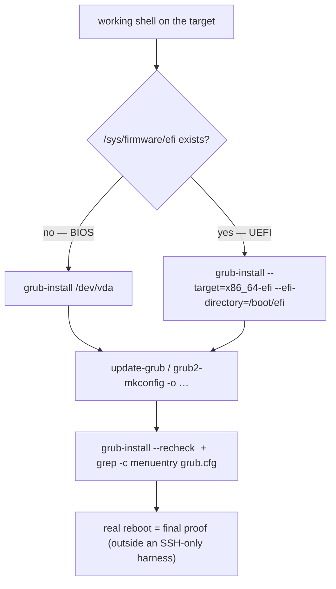

# Part 3 — The durable repair: reinstall and regenerate

> Prerequisite: [Part 2 — The one-boot manual rescue from `grub>`](./course-02-manual-rescue-from-grub.md). Next: [Section 080 quiz](../quiz.md).

You have a working shell — from the Part 2 manual boot, a chroot, or a system that booted on its own. The durable repair is both halves of Part 1's pair, in order, then a verification that does not need a reboot to be useful.

## Step 1 — reinstall GRUB's boot code

```bash
# shell: the working shell on the target (chroot or real), root
lsblk                                   # confirm the disk before writing to it
[ -d /sys/firmware/efi ] && echo UEFI || echo BIOS
```

**BIOS / legacy:**

```bash
sudo grub-install /dev/vda              # RHEL/openSUSE: grub2-install /dev/vda
```

Writes GRUB's boot code to the disk's boot sector / MBR gap. `grub-install` writes directly to a disk device — it deserves the same fresh identity check as any disk-level write.

**UEFI:**

```bash
sudo grub-install --target=x86_64-efi --efi-directory=/boot/efi
```

Targets the EFI system partition, not a raw disk device. This step is what fixes "GRUB's own code is missing or corrupted on disk" at the root; without it the next reboot returns to the broken state, because the Part 2 manual boot never touched the disk.

## Step 2 — regenerate the config

```bash
sudo update-grub                                       # Debian/Ubuntu
sudo grub2-mkconfig -o /boot/grub2/grub.cfg            # RHEL/openSUSE
```

Scans installed kernels and `/etc/default/grub`, rebuilds `grub.cfg` — the file Step 1's reinstalled code reads on the next real boot.

```bash
ls -l /boot/grub/grub.cfg      # exists, non-empty, fresh timestamp
```

## Step 3 — verify without rebooting

```bash
sudo grub-install --recheck /dev/vda     # reports success, or names exactly what is still wrong
grep -c menuentry /boot/grub/grub.cfg    # non-zero → the config has real bootable entries
```



On a real machine the final confirmation is still a real reboot — a normal menu (or unassisted boot) with no manual step. The lab stops short of that reboot, but every command up to it is the identical real repair.

> [!WARNING]
> - **`update-grub` only, on genuinely broken boot code** → still will not boot. Do `grub-install` first, every time.
> - **BIOS invocation on a UEFI system (or vice versa)** → check `/sys/firmware/efi` first; the two `grub-install` forms are not interchangeable.
> - **Running the repair outside the chroot** on a broken system → it targets the rescue environment's GRUB and kernels, not the target's.
> - **Skipping the `grep -c menuentry` check** → a regenerated `grub.cfg` can be a near-empty shell if `/boot` had no kernels visible; confirm it has entries.

> *Run `grub-install` (BIOS: `/dev/vda`; UEFI: `--target=x86_64-efi --efi-directory=/boot/efi`) then `update-grub` / `grub2-mkconfig`, and verify with `grub-install --recheck` and a non-zero `grep -c menuentry` before betting a reboot on it.*

## Reference

- `man grub-install` — `--target`, `--efi-directory`, `--recheck`, `--boot-directory`.
- `man grub-mkconfig` / `man update-grub` — the scan of `/boot` and `/etc/default/grub`.
- `man 5 grub` (`/etc/default/grub`) — `GRUB_CMDLINE_LINUX`, `GRUB_TIMEOUT`, and what a regenerated config picks up.
