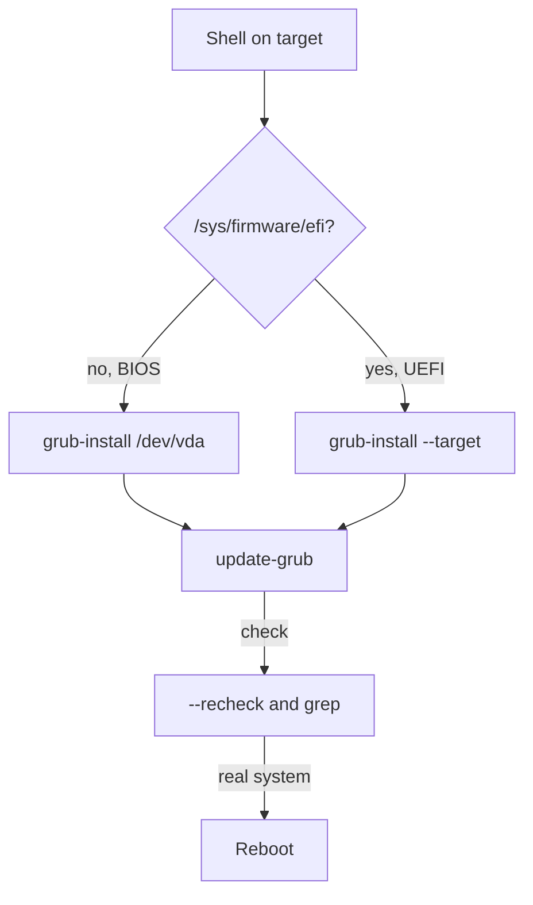

# The Durable Repair: Reinstall And Regenerate

Astronaut, you have a working shell on the ship: from a hand-built boot, from a chroot, or because the system still booted on its own. Now you make the fix last. Refit the launch computer with `grub-install`, write a fresh launch checklist with `update-grub`, and check both before you trust a reboot to them.

Run these commands on the target system itself. If the target cannot boot, run them inside a chroot of it, with `/dev`, `/proc` and `/sys` bind-mounted in, so they act on the target's disk and kernels and not on the rescue system's.

## Step 1: reinstall GRUB's boot code

`grub-install` needs to know two things: which disk to write to, and whether the machine starts with BIOS or UEFI firmware. Check both first.

### Check the disk and the firmware type

```bash
# shell: the working shell on the target (chroot or real), root
lsblk                                   # confirm the disk before writing to it
[ -d /sys/firmware/efi ] && echo UEFI || echo BIOS
```

The kernel creates the `/sys/firmware/efi` folder only when the machine was started by UEFI firmware. If it exists, use the UEFI form below; if not, use the BIOS form. `findmnt -no SOURCE /` shows the partition behind `/`, for example `/dev/vda1`. Remove the partition number to get the whole disk, `/dev/vda`.

### BIOS (legacy) machines

```bash
sudo grub-install /dev/vda              # RHEL/openSUSE: grub2-install /dev/vda
```

This writes GRUB's boot code to the start of the disk: the boot sector, plus a small hidden area (on GPT disks, a tiny BIOS boot partition) for the rest of the code. It writes straight to a whole disk, so it deserves the same fresh check of the disk name as any other disk-level write.

### UEFI machines

```bash
sudo grub-install --target=x86_64-efi --efi-directory=/boot/efi
```

This writes GRUB's EFI program into the EFI system partition, mounted at `/boot/efi`, instead of a raw disk. `x86_64-efi` is for 64-bit Intel and AMD machines; on an ARM machine the target is `arm64-efi`, and running `grub-install` with no `--target` usually picks the right one.

Either form fixes "GRUB's own code is missing or damaged on disk" at the root. Without it, the next reboot can return to the broken state.

## Step 2: write a fresh `grub.cfg`

```bash
sudo update-grub                                       # Debian/Ubuntu
sudo grub2-mkconfig -o /boot/grub2/grub.cfg            # RHEL/openSUSE
```

Run the line for the target's family. Both scan the installed kernels in `/boot` and the settings in `/etc/default/grub` (such as `GRUB_TIMEOUT` and `GRUB_CMDLINE_LINUX`), and write a new `grub.cfg`. That is the file the reinstalled boot code reads on the next real boot.

```bash
ls -l /boot/grub/grub.cfg      # exists, non-empty, fresh timestamp
```

## Step 3: check the repair without rebooting

```bash
sudo grub-install --recheck /dev/vda     # reports success, or names exactly what is still wrong
grep -c menuentry /boot/grub/grub.cfg    # non-zero → the config has real bootable entries
```

`--recheck` tells `grub-install` to throw away its old map of the disks and look at them again, then install once more. It is not a read-only test. A run that ends with `No error reported` means GRUB could find the disk and write its code; an error names what is still wrong. On a UEFI machine, use the same `--target` and `--efi-directory` options as in Step 1 instead of the disk name.

`grep -c menuentry` counts the boot entries in the new file. A number above zero means `update-grub` found at least one kernel.


```mermaid
flowchart TD
    W["Shell on target"] --> FW{"/sys/firmware/efi?"}
    FW -->|"no, BIOS"| GI1["grub-install /dev/vda"]
    FW -->|"yes, UEFI"| GI2["grub-install --target"]
    GI1 --> UG["update-grub"]
    GI2 --> UG
    UG -->|"check"| V["--recheck and grep"]
    V -->|"real system"| RB["Reboot"]
```

The diagram shows the order: check the firmware, run the matching `grub-install`, run `update-grub`, check both, and only then reboot. The UEFI box stands for `grub-install --target=x86_64-efi --efi-directory=/boot/efi`.

On a real machine the final proof is still a real reboot: a normal menu, or a boot with no manual steps. The mission stops before that reboot, but every command up to it is the real repair.

## Common pitfalls

> [!WARNING]
> - **Running only `update-grub` when the boot code is broken.** It still will not boot. Run `grub-install` first, every time.
> - **Using the BIOS form on a UEFI machine, or the other way round.** Check `/sys/firmware/efi` first; the two forms of `grub-install` are not interchangeable.
> - **Running the repair outside the chroot on a system that cannot boot.** It then repairs the rescue system's GRUB and kernels, not the target's.
> - **Skipping the `grep -c menuentry` check.** A new `grub.cfg` can be almost empty if no kernels were visible in `/boot`. Confirm it has entries.

## Your mission: GRUB Corruption Recovery Lab

You can now reinstall GRUB's boot code, write a fresh `grub.cfg` and check both without a reboot. The mission asks you to repair a training ship whose `/boot/grub/grub.cfg` is gone, before its next reboot.

Start the mission and open a terminal on it:

```sh
astrona run --git git@github.com:astrona-io/ATS002.git -c sections/section-080/module-04/labs/lab-01
astrona ssh ats-002-lab-084
```

Read the task in [`question.md`](./labs/lab-01/question.md) and solve it on your own first. When you think you are done, send it for grading:

```sh
astrona submit -c sections/section-080/module-04/labs/lab-01
```

When the mission is done, remove it:

```sh
astrona destroy ats-002-lab-084
```
